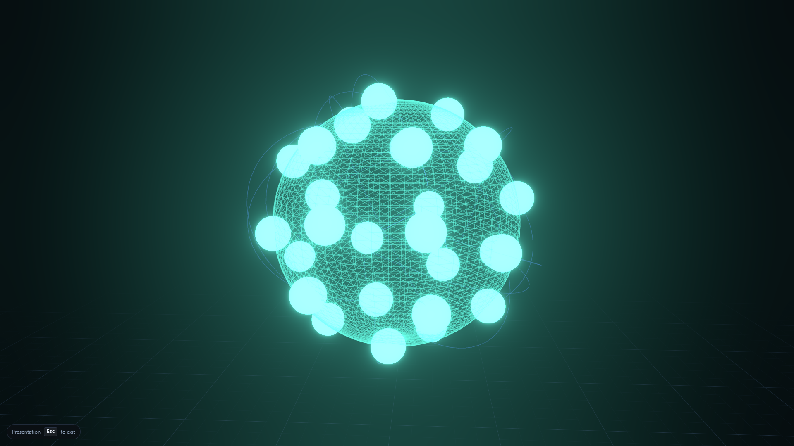

<div align="center">

# OACP — Open Agent Collaboration Protocol

**Multi-agent collaboration you can observe, trace, and operate in production.**

OACP gives autonomous agents a shared protocol for identity, capability routing, delegation,
and reliable delivery — with the **OACP Console** for live and historical trace visibility.

[](./docs/releases/v1.0.0.md)
[](./specs)
[](./LICENSE)
[](https://www.typescriptlang.org/)
[](https://github.com/naaa-G/OACP/actions)

[Quick Start](#quick-start) · [Console](#oacp-console) · [Documentation](https://naaa-g.github.io/OACP) · [Examples](#examples) · [Contributing](./CONTRIBUTING.md)

</div>

<p align="center">
  <a href="#quick-start">
    
  </a>
  <br />
  <strong>OACP Console</strong> — Showcase 3D and Ops 2D delegation views
  · <a href="./docs/demo-scripts.md">Run the demo</a>
</p>

---

## Why OACP

Building one capable agent is straightforward. Running **several agents that coordinate reliably** is not. Most teams end up with ad-hoc HTTP glue, opaque message passing, and no shared model for identity, capabilities, or traceability.

OACP standardizes the infrastructure layer:

| Concern           | What OACP provides                                                                  |
| ----------------- | ----------------------------------------------------------------------------------- |
| **Messaging**     | Schema-validated envelopes: `task_request`, `task_response`, `delegation`, and more |
| **Identity**      | Agent IDs, declared capabilities, and public-key identity                           |
| **Routing**       | Capability-based discovery and delivery with retries and timeouts                   |
| **Orchestration** | DAG workflows, delegation graphs, and shared memory                                 |
| **Observability** | `/v1/observability/*` APIs, SSE events, and the OACP Console                        |

OACP is a **collaboration and orchestration layer**. It complements tool and model protocols (MCP, A2A, framework adapters) rather than replacing them. See [Comparison & interoperability](#comparison--interoperability).

---

## Features

| Area             | Capability                                                                                         |
| ---------------- | -------------------------------------------------------------------------------------------------- |
| **Protocol**     | Versioned JSON Schema message types (`v1.0`), OpenAPI `/v1/*` surface                              |
| **Runtime**      | In-process and networked agents; HTTP server with registry and workflows                           |
| **SDKs**         | TypeScript (`@oacp/sdk`) and Python (`oacp-sdk`)                                                   |
| **Console**      | Showcase 3D graph, Ops 2D hierarchy, agent catalog, live message feed                              |
| **Platform**     | Docker Compose stack, API key auth, SQLite persistence, MCPLab sync                                |
| **Integrations** | LangChain, AutoGen; [MCPLab](https://github.com/naaa-G/MCPLab); MCP tools server and Cursor skills |

Full capability matrix: [documentation site](https://naaa-g.github.io/OACP).

---

## Quick start

### Docker (recommended)

Run the platform and Console without a local Node build:

```bash
git clone https://github.com/naaa-G/OACP.git
cd OACP
docker compose up --build -d
```

Open **http://127.0.0.1:3847/console/?mode=showcase**

Seed demo traces:

```bash
docker compose --profile demo up --build
pnpm demo:fallback   # host-side fixtures when LLM/network unavailable
```

**MCPLab full stack** ([MCPLab](https://github.com/naaa-G/MCPLab) — clone alongside this repo):

```bash
git clone https://github.com/naaa-G/MCPLab.git MCPLab
pnpm docker:mcplab
```

Guides: [docker-compose.md](./docs/docker-compose.md) · [demo-scripts.md](./docs/demo-scripts.md)

### Integrate your agents

Register agents via the SDK and open traces in the Console — no MCPLab required:

```bash
pnpm install && pnpm build
pnpm --filter oacp-examples start:custom-agents
```

| Resource                                                 | Description                                       |
| -------------------------------------------------------- | ------------------------------------------------- |
| [Bring your own agents](./docs/bring-your-own-agents.md) | SDK registration, fleet/role metadata, deep links |
| [Integration surfaces](./docs/integration-surfaces.md)   | SDK vs MCP adapter vs Cursor skills               |
| [Distribution](./docs/distribution.md)                   | npm, PyPI, Docker, MCP                            |
| [MCP tools server](./integrate/mcp-oacp/)                | Optional stdio MCP wrapper over `/v1/*`           |

### Local development

```bash
git clone https://github.com/naaa-G/OACP.git
cd OACP
pnpm install
pnpm verify    # format · lint · typecheck · test · build
```

Run the Autonomous Startup Team from the CLI:

```bash
pnpm oacp run "build todo app" --keep-alive
```

Open the Console URL printed in the output (`/console/?trace_id=…`).

Developer guide: [development.md](./docs/development.md) · [quick-start.md](./docs/quick-start.md)

### Minimal SDK example

```ts
import { Agent, LocalBus } from '@oacp/sdk';

const bus = new LocalBus();

const worker = new Agent({
  name: 'summarizer',
  capabilities: ['text.summarize'],
  bus,
  onTask: async (task) => ({
    output: `Summary: ${task.input.text.slice(0, 40)}…`,
  }),
});

const coordinator = new Agent({
  name: 'coordinator',
  capabilities: ['orchestrate'],
  bus,
});

await Promise.all([worker.start(), coordinator.start()]);

const result = await coordinator.sendTask({
  capability: 'text.summarize',
  input: { text: 'OACP lets agents collaborate over a shared protocol.' },
});

console.log(result.output);
```

---

## OACP Console

The Console is the default observability UI, served at **`/console`** from the OACP platform (port **3847** in Docker).

| Mode         | URL              | Use case                                 |
| ------------ | ---------------- | ---------------------------------------- |
| **Showcase** | `?mode=showcase` | Demos, presentations, 3D fleet graph     |
| **Ops**      | `?mode=ops`      | Delegation drill-down, incident analysis |

Deep link example:

```text
http://127.0.0.1:3847/console/?trace_id=<uuid>&mode=showcase
```

**Highlights:** live SSE feed, agent catalog with fleet/role grouping, trace replay, PNG export, optional API key auth (`OACP_API_KEY`).

User guide: [console.md](./docs/console.md) · API: [observability.md](./docs/observability.md)

> **Legacy playground:** `/playground` redirects to `/console`. See [playground.md](./docs/playground.md).

---

## Core concepts

| Concept              | Description                                                          |
| -------------------- | -------------------------------------------------------------------- |
| **Agent**            | Addressable participant with `id`, `capabilities[]`, and `publicKey` |
| **Capability**       | Named skill used for discovery and routing (e.g. `code.debug`)       |
| **Message**          | Typed envelope with `trace_id` linking a collaboration session       |
| **Registry**         | Maps capabilities to registered agents                               |
| **Delegation graph** | Who delegated what to whom — visible in Ops and Showcase modes       |
| **Orchestrator**     | DAG workflow engine for multi-step agent pipelines                   |

---

## Architecture


```text
┌──────────────────────────────────────────────────────────────┐
│                    OACP Console  (/console)                  │
│         Showcase 3D · Ops 2D · agent catalog · message feed  │
└───────────────────────────────┬──────────────────────────────┘
                                │ /v1/observability/*
┌───────────────────────────────▼──────────────────────────────┐
│                       OACP Server                            │
│   HTTP API · registry · orchestrator · SSE · persistence     │
└───────────────────────────────┬──────────────────────────────┘
                                │
┌───────────────────────────────▼──────────────────────────────┐
│                         @oacp/core                           │
│   Protocol · routing · runtime · workflow · memory           │
└───────────────────────────────┬──────────────────────────────┘
                                │
┌───────────────────────────────▼──────────────────────────────┐
│              specs/  — JSON Schema (source of truth)         │
└──────────────────────────────────────────────────────────────┘
        ▲                              ▲
   @oacp/sdk                      Framework adapters
   (TypeScript / Python)          (LangChain, AutoGen, …)
```

Details: [architecture.md](./docs/architecture.md)

---

## Protocol

Message types are defined as JSON Schemas under [`specs/`](./specs) and validated at runtime. Protocol version **`1.0`** is frozen for the v1.0 release.

| Message            | Purpose                                    |
| ------------------ | ------------------------------------------ |
| `task_request`     | Ask an agent or capability to perform work |
| `task_response`    | Return a result or error                   |
| `delegation`       | Hand a subtask to another agent            |
| `capability_query` | Discover agents for a capability           |
| `memory_share`     | Share scoped context between agents        |
| `heartbeat`        | Liveness signaling                         |

```json
{
  "type": "task_request",
  "version": "1.0",
  "trace_id": "0c8f1e2a-7b3d-4f9e-9b1a-2d4e6f8a0c66",
  "from": "agent://coordinator",
  "capability": "text.summarize",
  "input": { "text": "…" },
  "deadline_ms": 30000
}
```

Reference: [message-types.md](./docs/message-types.md) · Migration: [v0.1 → v1.0](./docs/migration/v0.1-to-v1.0.md)

---

## SDKs

| Language   | Package     | Install                |
| ---------- | ----------- | ---------------------- |
| TypeScript | `@oacp/sdk` | `pnpm add @oacp/sdk`   |
| Python     | `oacp-sdk`  | `pip install oacp-sdk` |

```ts
import { PROTOCOL_VERSION, SDK_VERSION } from '@oacp/sdk';
console.log(PROTOCOL_VERSION); // "1.0"
console.log(SDK_VERSION); // "1.0.0"
```

Guides: [sdk-typescript.md](./docs/sdk-typescript.md) · [sdk-python.md](./docs/sdk-python.md) · [integrations.md](./docs/integrations.md)

---

## Examples

Runnable examples in [`examples/`](./examples):

| Command                                                | Description                   |
| ------------------------------------------------------ | ----------------------------- |
| `pnpm oacp run "build todo app"`                       | CLI — Autonomous Startup Team |
| `pnpm --filter oacp-examples start:custom-agents`      | Minimal BYO agents → Console  |
| `pnpm --filter oacp-examples start:startup`            | Startup team with live trace  |
| `pnpm --filter oacp-examples start:coding-swarm`       | Coding pipeline swarm         |
| `pnpm --filter oacp-examples start:research-swarm`     | Research brief DAG            |
| `pnpm --filter oacp-examples start:bug-finder-swarm`   | Bug triage with recovery      |
| `pnpm --filter oacp-examples start:demo`               | Remote agents over HTTP       |
| `pnpm --filter oacp-examples start:langchain-delegate` | LangChain → OACP delegation   |

Gallery: [examples-gallery.md](./docs/examples-gallery.md) · CLI: [cli.md](./docs/cli.md)

---

## Project structure

```text
oacp/
├── apps/console/           # OACP Console (React + Three.js)
├── packages/
│   ├── ui/                 # @oacp/ui design system
│   └── observability-client/
├── specs/                  # Protocol JSON Schemas + OpenAPI
├── core/                   # Engine: protocol, routing, runtime, memory
├── server/                 # HTTP API, registry, observability, persistence
├── sdk/                    # TypeScript and Python clients
├── examples/               # Runnable demos and integration samples
├── integrations/           # LangChain, AutoGen adapters
├── integrate/              # MCP adapter, Cursor skills, MCPLab templates
├── cli/                    # oacp CLI
└── docs/                   # Documentation (VitePress site)
```

---

## Comparison & interoperability

| Standard                         | Focus                    | Relationship to OACP                                          |
| -------------------------------- | ------------------------ | ------------------------------------------------------------- |
| **MCP**                          | Models ↔ tools/data      | Complementary — agents use MCP tools; OACP coordinates agents |
| **A2A**                          | Agent-to-agent messaging | Overlapping — OACP aims to bridge, not replace                |
| **LangChain / AutoGen / CrewAI** | Agent frameworks         | Adapters register framework agents on an OACP network         |

---

## Documentation

| Doc                                                         | Topic                          |
| ----------------------------------------------------------- | ------------------------------ |
| [Documentation site](https://naaa-g.github.io/OACP)         | Full guides and API reference  |
| [quick-start.md](./docs/quick-start.md)                     | First run paths                |
| [production-deployment.md](./docs/production-deployment.md) | API keys, env vars, operations |
| [security-model.md](./docs/security-model.md)               | Identity, auth, threat model   |
| [releases/v1.0.0.md](./docs/releases/v1.0.0.md)             | v1.0.0 release notes           |

---

## Contributing

Contributions welcome. See [CONTRIBUTING.md](./CONTRIBUTING.md) and [CODE_OF_CONDUCT.md](./CODE_OF_CONDUCT.md).

```bash
pnpm install
pnpm verify       # recommended before opening a PR
```

Community: [community.md](./docs/community.md)

---

## Security

Report vulnerabilities per [SECURITY.md](./SECURITY.md) — do not open public issues for security findings.

---

## License

Apache License 2.0 — see [LICENSE](./LICENSE).

---

<div align="center">

**OACP** — open protocol for multi-agent collaboration with production-grade observability.

[Star on GitHub](https://github.com/naaa-G/OACP) · [Documentation](https://naaa-g.github.io/OACP)

</div>
