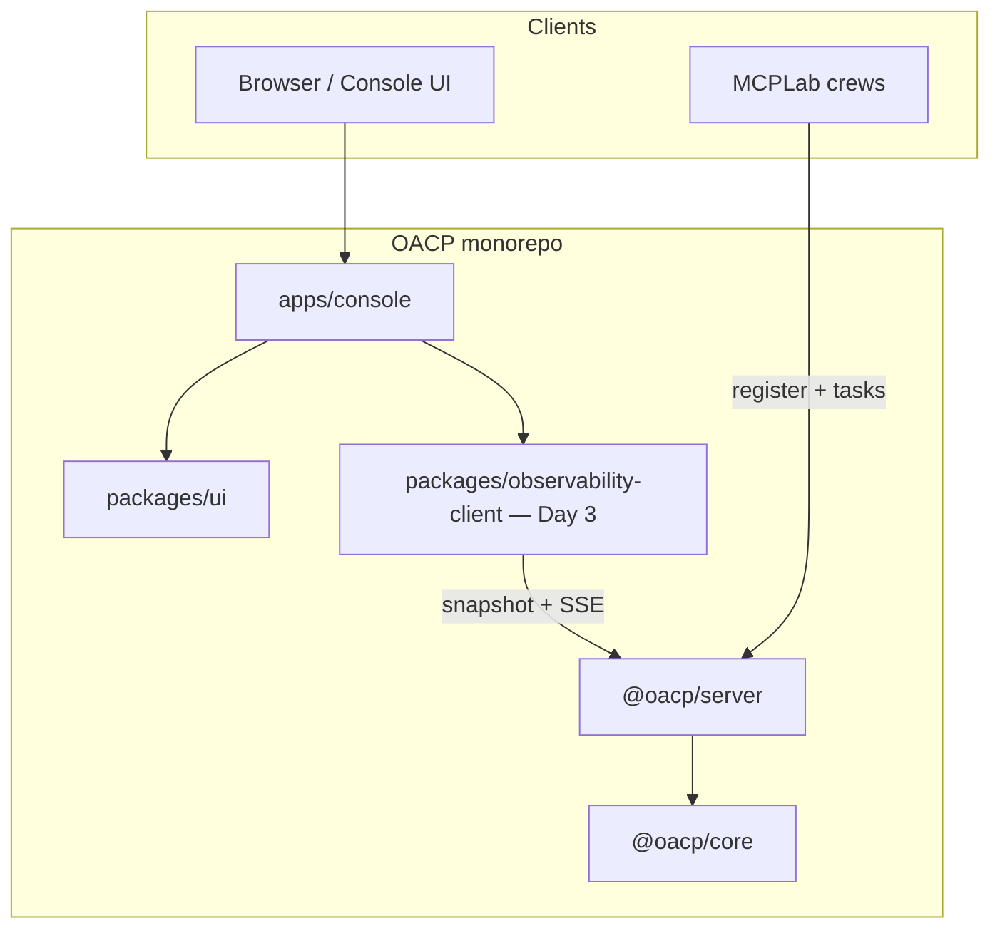
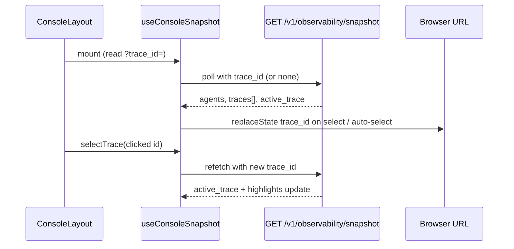
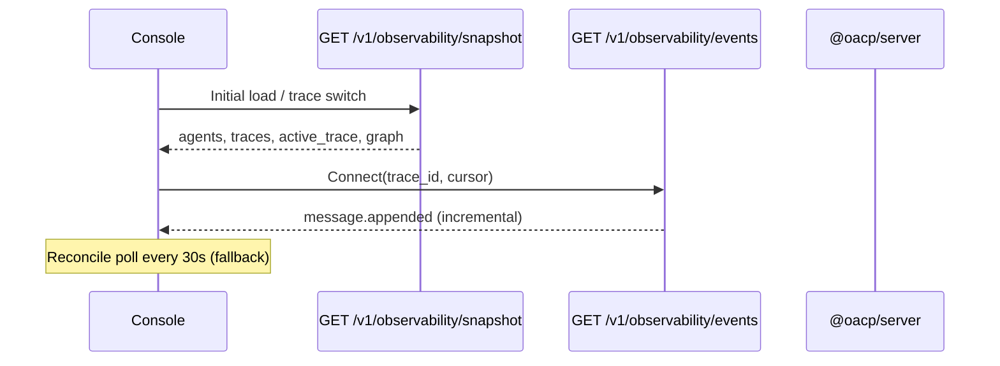

# OACP Console — architecture

The **OACP Console** (`apps/console`) is the v1.0 observability product surface. It replaces the legacy inline playground (`server/src/observability/playground-html.ts`) with a React application backed by `/v1/observability/*` APIs.

See the [60-day build plan](./version1.md) for delivery milestones.

## System context



## Package boundaries

| Package                      | Path                             | Responsibility                                            |
| ---------------------------- | -------------------------------- | --------------------------------------------------------- |
| `@oacp/console`              | `apps/console/`                  | React SPA — agent catalog, delegation graph, message flow |
| `@oacp/ui`                   | `packages/ui/`                   | Design tokens, theme CSS, shared primitives (Day 2+)      |
| `@oacp/observability-client` | `packages/observability-client/` | Typed snapshot client + React Query hooks (Day 3)         |
| `@oacp/server`               | `server/`                        | Serves built Console at `/console`; observability APIs    |

## Console component tree (target — Day 60)

```text
App
├── ConsoleLayout
│   ├── ConsoleHeader          # Live toggle, poll interval, connection status
│   └── ConsoleMain
│       ├── AgentCatalogPanel  # Fleet/role list, search, filters (M10)
│       ├── GraphPanel
│       │   ├── OpsGraph       # React Flow hierarchical 2D (M11)
│       │   └── ShowcaseGraph  # Three.js 3D sphere/force (M11)
│       ├── MessageFlowPanel   # Append-only feed + SSE (Day 47)
│       └── TraceRail          # Recent traces, status badges
├── AgentDetailDrawer          # Identity, capabilities, recent traces (M10)
└── providers
    ├── SnapshotProvider       # TanStack Query — GET /v1/observability/snapshot
    ├── EventStreamProvider    # EventSource — GET /v1/observability/events
    └── SelectionStore         # Zustand — selectedAgentId, traceId, graphMode
```

**Day 1 (complete):** `App` → `TokenPreview` validated `@oacp/ui` tokens.

**Day 2 (complete):** `App` → `ConsoleLayout` with `ConsoleHeader` and four panel regions.

**Day 3 (complete):** `ConsoleProviders` + `useSnapshot` — live stats from `GET /playground/snapshot`.

**Day 4 (complete):** `AgentsPanel` renders read-only agent cards with active-trace highlighting.

**Day 5 (complete):** `TraceRail` lists recent traces with selection; `useConsoleSnapshot` syncs `?trace_id=` deep links and refetches the active trace bundle.

**Day 13 (complete):** Zustand `SelectionStore` — `selectedAgentId`, `selectedTraceId`, `graphMode`; agent card click toggles selection with persistent ring; URL syncs `agent` + `trace_id`; selection survives poll refresh.

**Day 14 (complete):** `formatObservabilityError` + global `ErrorBanner` (401/500/network); header `Connected` / `Reconnecting` / `Offline`; panel empty states; `ConsoleErrorBoundary`.

**Day 6 (complete):** Console consumes `GET /v1/observability/snapshot`; legacy `/playground/snapshot` remains compatible.

**Day 7 (complete):** `@oacp/server` serves `apps/console/dist` at `/console/` with SPA fallback; `/playground` redirects to `/console/`.

**Day 8 (complete):** `MessageFlowPanel` renders `active_trace.timeline` (40-message tail); `GraphPanel` shows loading SVG placeholder and ready-state preview.

**Day 27 (complete):** `GraphPanel` renders `OpsGraph` when `mode=ops` — React Flow + dagre hierarchical layout from trace graph API; `LegacyRingGraph` remains default.

**Day 28 (complete):** Ops nodes have no permanent labels; hover tooltips and click-to-pin labels via `OpsGraphLabel` + `NodeToolbar`.

**Day 29 (complete):** `OpsDelegationEdge` — bezier edges, kind colors, message-scaled width, arrow markers, hover tooltips; legend in `GraphPanel`.

**Day 30 (complete):** Active vs idle node sizing, glow, pulse; selection ring; `prefers-reduced-motion` — **Week 6 ops graph complete**.

```text
App
└── ConsoleProviders          # QueryClient + ObservabilityProvider
    └── ConsoleLayout
        ├── ConsoleHeader     # Live toggle, poll interval, Refresh, Connected/Offline
        ├── ErrorBanner       # Snapshot fetch errors
        └── main (CSS grid)
            ├── AgentsPanel   # AgentCard list, stats, active highlight, click-to-select (Day 13)
            ├── GraphPanel    # SVG ring graph; selected node stroke (Day 13)
            ├── MessageFlowPanel  # Timeline feed from active_trace (Day 8)
            └── TraceRail     # TraceRailRow list, click-to-select, URL sync
```

**Day 13 (complete):** `store/selection-store.ts` (Zustand) coordinates trace + agent selection across panels; `syncSelectionToSearch` keeps shareable URLs.

**Day 6+:** Snapshot API v1, graph rendering, message feed.

## View modes

| Mode             | URL param         | Purpose                                         |
| ---------------- | ----------------- | ----------------------------------------------- |
| **Ops**          | `?mode=ops`       | 2D hierarchical graph — debugging, dense traces |
| **Showcase**     | `?mode=showcase`  | Three.js 3D graph — demos, README, conference   |
| **Presentation** | `?presentation=1` | Full-screen Showcase, auto-rotate               |

Performance budgets and manual QA: [console-performance-budget.md](./console-performance-budget.md), [console-showcase-qa-checklist.md](./console-showcase-qa-checklist.md).

## Design system (`@oacp/ui`)

Tokens are defined in TypeScript (`packages/ui/src/tokens/`) and mirrored as CSS custom properties (`theme.css`).

| Token module | Examples                                           |
| ------------ | -------------------------------------------------- |
| `colors`     | `--oacp-bg`, `--oacp-accent`, fleet hues           |
| `typography` | `--oacp-font-sans`, `--oacp-font-mono`             |
| `layout`     | `--oacp-sidebar-width`, `--oacp-trace-rail-height` |
| `motion`     | `--oacp-duration-normal`, reduced-motion overrides |

**Rule:** Console application code must use CSS variables or `@oacp/ui` tokens — no hard-coded hex in feature components.

## Data flow (Day 5 — trace selection)



## Data flow (target — Day 10+)



## Build & serve

| Environment | Command                                          | URL                            |
| ----------- | ------------------------------------------------ | ------------------------------ |
| **Dev**     | `pnpm --filter @oacp/console dev`                | http://127.0.0.1:5173          |
| **Prod**    | `pnpm build && pnpm --filter @oacp/server start` | http://127.0.0.1:3847/console/ |

Vite dev server proxies `/v1` and `/playground` API routes to `@oacp/server`. Production serves the Console bundle and APIs from a single origin.

## Related docs

- [console.md](./console.md) — development guide
- [version1.md](./version1.md) — 60-day plan
- [playground.md](./playground.md) — legacy UI (deprecated)
- [observability.md](./observability.md) — trace APIs and logging
- [delegation-graph.md](./delegation-graph.md) — graph semantics
