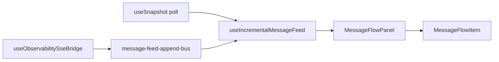

# Console message feed (incremental updates)

The message flow panel renders the tail of `active_trace.timeline` with **append-only reconciliation** (Day 47) and optional SSE `message.appended` events (Day 46).

## Architecture



| Layer        | File                                                      | Responsibility                                                      |
| ------------ | --------------------------------------------------------- | ------------------------------------------------------------------- |
| Merge engine | `packages/observability-client/src/timeline-feed-diff.ts` | Append by `message_id`; preserve row object references              |
| SSE bus      | `apps/console/src/utils/message-feed-append-bus.ts`       | Decouple EventSource from feed hook                                 |
| Feed hook    | `apps/console/src/hooks/useIncrementalMessageFeed.ts`     | Poll reconcile + SSE subscribe; track `newMessageIds` for animation |
| Virtual list | `apps/console/src/components/VirtualizedMessageFeed.tsx`  | TanStack Virtual for 1000+ rows (Day 49)                            |
| Filters      | `apps/console/src/utils/message-feed-filter.ts`           | Client-side type/agent/capability/status/text filters               |
| Panel        | `apps/console/src/panels/MessageFlowPanel.tsx`            | Render list; replay mode bypasses live append                       |
| Row          | `apps/console/src/components/MessageFlowItem.tsx`         | Expandable JSON detail, latency, correlation ids                    |

## Append-only merge

`mergeTimelineEventsAppendOnly(existing, incoming, limit?)`:

1. Skips rows whose `message_id` already exists in `existing`
2. Pushes only new rows — **never replaces or reorders** existing row objects
3. Applies `FEED_TAIL_LIMIT` (40) after merge

Poll reconciliation and SSE both use the same merge function so React keys stay stable and existing `<li>` nodes are not remounted.

## SSE path

`useObservabilitySseBridge` calls `enqueueMessageFeedAppend(event.data)` on `message.appended`. The hook filters by `selectedTraceId` and optional agent scope before merging.

Initial timeline hydration still comes from snapshot poll; SSE fills gaps between polls.

## Animation

- Only rows in `newMessageIds` receive `MessageFlowItem` `isNew` (CSS `.newItem` slide-in)
- Each `message_id` animates at most once per trace/agent scope (`animatedIdsRef`)
- `prefers-reduced-motion: reduce` disables animation

## Smart auto-scroll (Day 48)

| Behavior      | Implementation                                                                                   |
| ------------- | ------------------------------------------------------------------------------------------------ |
| Pin threshold | `FEED_SCROLL_PIN_THRESHOLD_PX` (50px) — `feed-scroll.ts`                                         |
| Auto-scroll   | `useMessageFeedScroll` scrolls to bottom only when pinned                                        |
| Scrolled up   | `FeedNewMessagesChip` shows `↓ N new messages`; click scrolls + clears count                     |
| Pause feed    | Panel header **Feed** toggle — freezes DOM; buffers poll + SSE in `message-feed-pause-buffer.ts` |
| Resume        | Uncheck pause (or banner **Resume**) — flush buffer via append-only merge                        |

When the global **Live** header toggle is off, polling and SSE stop entirely. The feed **Feed** toggle is trace-local: snapshot polls continue but the feed UI holds until resumed.

## Hover pause + virtual list (Day 49)

| Behavior     | Implementation                                                                                              |
| ------------ | ----------------------------------------------------------------------------------------------------------- |
| Hover pause  | `onMouseEnter` / `onMouseLeave` on `#feedPanel` scroll root — reuses pause buffer; `data-feed-hover-paused` |
| Virtual list | `VirtualizedMessageFeed` + `@tanstack/react-virtual`; tail up to `FEED_VIRTUAL_TAIL_LIMIT` (5000)           |
| Expand row   | `MessageFlowItem` `+` toggle — latency vs previous row, correlation ids, full JSON                          |
| Filter bar   | `MessageFeedFilterBar` — type, agent, capability, status, free-text (client-side on loaded tail)            |

Manual **Feed** pause and hover pause share the same buffer/flush path in `useIncrementalMessageFeed`.

## Replay mode

When `replayMessageIndex` is set, the panel slices the full timeline prefix and disables live SSE append. Scrub highlight uses `data-scrub-active` on the active row.

## Panel attributes

| Attribute                              | Values           | Purpose                                |
| -------------------------------------- | ---------------- | -------------------------------------- |
| `data-feed-row-count`                  | number           | E2E / debugging visible row count      |
| `data-feed-live`                       | `true` / `false` | Live incremental mode vs replay        |
| `data-feed-paused`                     | `true` / `false` | Feed pause toggle (Day 48)             |
| `data-feed-buffered-count`             | number           | Messages buffered while paused         |
| `data-feed-pending-scroll`             | number           | New messages while scrolled up         |
| `data-feed-pinned`                     | `true` / `false` | Whether feed is within 50px of bottom  |
| `data-testid="feed-scroll-viewport"`   | —                | Scroll container for smart auto-scroll |
| `data-testid="feed-new-messages-chip"` | —                | Jump-to-bottom chip                    |
| `data-feed-hover-paused`               | `true` / `false` | Hover pause active (Day 49)            |
| `data-testid="feed-virtual-list"`      | —                | TanStack Virtual scroll surface        |
| `data-testid="feed-filter-bar"`        | —                | Client-side filter controls            |
| `data-testid="feed-scroll-root"`       | —                | Hover pause target                     |
| `data-testid="feed-pause-toggle"`      | —                | Feed pause checkbox in panel header    |

## Testing

```bash
pnpm --filter @oacp/observability-client test -- timeline-feed-diff timeline-feed trace-format reconcile
pnpm --filter @oacp/console test -- message-feed-filter message-feed-detail feed-scroll timeline-export
pnpm --filter @oacp/console test:e2e:feed
```

## Related

- [console-spec.md](./console-spec.md) — timeline schema; Issue #3 usability checklist
- [console-message-feed-qa-checklist.md](./console-message-feed-qa-checklist.md) — Issue #3 manual sign-off
- [observability-events.md](./observability-events.md) — SSE `message.appended`
- [console-components.md](./console-components.md) — `MessageFlowPanel` / `MessageFlowItem`

## Day 50 — Feed polish + Issue #3 sign-off

### Message tone system

| Message type            | Tone               | Accent           |
| ----------------------- | ------------------ | ---------------- |
| `task_request`          | `request`          | Blue `#5b9cf5`   |
| `delegation`            | `delegation`       | Purple `#a78bfa` |
| `task_response` success | `response-success` | Green            |
| `task_response` error   | `response-error`   | Red              |
| Other                   | `neutral`          | Muted border     |

Implementation: `timelineMessageTone` + `TIMELINE_MESSAGE_TONE_STYLES` in `@oacp/observability-client`; `MessageFlowItem` exposes `data-message-tone` for tests and tooling.

### Timeline export

Panel header **JSONL** / **CSV** buttons call `downloadTimelineExport()` with the filtered visible tail (respects agent scope and client-side filters). Filenames: `oacp-timeline-<trace-id>.{jsonl,csv}`.

### Trace rail upgrades

`TraceRailRow` shows **Running** / **Completed** / **Failed** badges and formatted duration via `trace-format.ts` helpers (`formatTraceDuration`, `resolveTraceDisplayStatus`).

### SSE-primary live transport (Week 10 exit)

| Transport                            | Role                                                                                |
| ------------------------------------ | ----------------------------------------------------------------------------------- |
| **SSE** (`/v1/observability/events`) | Primary live path — feed append, graph edge pulses, debounced snapshot/graph resync |
| **Snapshot poll** (default **30s**)  | Reconcile fallback — agent registry, trace list, timeline drift correction          |
| **Manual Refresh**                   | On-demand full resync                                                               |

Header control: **Reconcile 15s / 30s / 60s** (`SNAPSHOT_RECONCILE_INTERVAL_MS`). Persisted in `sessionStorage` (`oacp.console.reconcileIntervalMs.v1`).

`useObservabilitySseBridge` invalidates TanStack Query caches on:

- `message.appended` → feed bus + debounced resync (`SSE_DEBOUNCED_RESYNC_MS` = 1.5s)
- `agent.registered` → snapshot
- `trace.started` / `trace.completed` / `stream.resync` → snapshot + trace graph

### Issue #3 closure

Root cause fixed: append-only merge (Day 47), smart auto-scroll (Day 48), hover pause + virtual list (Day 49), tone/export/trace rail polish (Day 50).

Automated sign-off:

```bash
pnpm --filter @oacp/observability-client test -- timeline-feed trace-format reconcile
pnpm --filter @oacp/console test -- timeline-export
pnpm --filter @oacp/console test:e2e:feed
```

Manual demo checklist: [console-message-feed-qa-checklist.md](./console-message-feed-qa-checklist.md).

**Acceptance log (2026-06-30)**

| Check                            | Result                                                                  |
| -------------------------------- | ----------------------------------------------------------------------- |
| `SNAPSHOT_RECONCILE_INTERVAL_MS` | 30s default; 15s/60s presets                                            |
| `useObservabilitySseBridge`      | SSE-primary with debounced resync                                       |
| `timelineMessageTone`            | Request/delegation/response tones                                       |
| `timeline-export.ts`             | JSONL + CSV download actions                                            |
| `TraceRailRow`                   | Duration + status badges                                                |
| Vitest                           | `timeline-feed`, `trace-format`, `timeline-export`, `reconcile`         |
| E2E                              | `console-message-feed-day50.spec.ts` + scroll/virtual/incremental suite |
| Issue #3                         | Closed — see QA checklist                                               |
