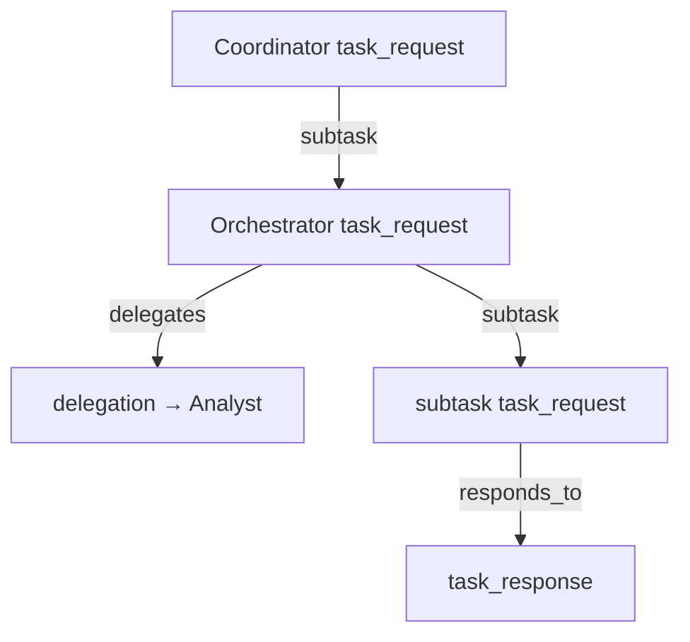

# Task delegation graph (Day 16)

OACP tracks **who delegated what** and **dependency chains** within a `trace_id`. The delegation graph complements the [memory system](./memory-system.md) (Day 15) with a structured view suitable for observability, workflow engines (Day 18), and the [playground UI](./playground.md) (Day 22).

## Concepts

| Term      | Meaning                                                               |
| --------- | --------------------------------------------------------------------- |
| **Node**  | A `task_request`, `delegation`, or `task_response` message in a trace |
| **Edge**  | A directed relationship between correlated messages                   |
| **Root**  | A work node with no parent `delegates` or `subtask` edge              |
| **Depth** | Maximum chain length along delegation/subtask edges                   |

### Edge kinds

| Kind          | From → To                            | Source                                             |
| ------------- | ------------------------------------ | -------------------------------------------------- |
| `subtask`     | Parent task → child `task_request`   | `sendSubTask()` / `ExecutionContext.sendSubTask()` |
| `delegates`   | Parent task → `delegation`           | `delegate()` / `ExecutionContext.delegate()`       |
| `responds_to` | Request/delegation → `task_response` | Protocol `in_reply_to`                             |



## Core API (`@oacp/core`)

### Recording

Attach a shared `DelegationGraphRecorder` to each `AgentRuntime` (or SDK `Agent`) in a collaboration:

```typescript
import { createAgentRuntime, createDelegationGraphRecorder, createMessageBus } from '@oacp/core';

const graphRecorder = createDelegationGraphRecorder();

const worker = createAgentRuntime({
  identity: workerIdentity,
  bus,
  delegationGraphRecorder: graphRecorder,
  onTask: async (task, ctx) => {
    await ctx.sendSubTask({ capability: 'downstream.work', input: task.input });
    return { output: { done: true } };
  },
});
```

`sendSubTask` automatically sets `parentMessageId` to the current task's `message_id`. Explicit `delegate()` uses the protocol `parent_message_id` field.

### Querying

```typescript
const graph = await graphRecorder.getGraph(traceId);
// graph.nodes, graph.edges, graph.roots, graph.leaves, graph.depth

import { delegationTopologicalOrder, getDelegationAncestors } from '@oacp/core';

const order = delegationTopologicalOrder(graph); // roots first
const ancestors = getDelegationAncestors(graph, messageId);
```

### Reconstruction from memory

Rebuild a graph after restart or from audit logs:

```typescript
import { buildDelegationGraphFromMemoryEntries } from '@oacp/core';

const entries = await memoryStore.query({ trace_id: traceId, limit: 1000 });
const graph = buildDelegationGraphFromMemoryEntries(entries);
```

Subtask parent links are stored in memory entry payloads as `parent_message_id` (Day 16).

## HTTP API (`@oacp/server`)

```
GET /graph/traces/:traceId
```

Returns:

```json
{
  "ok": true,
  "graph": {
    "trace_id": "...",
    "nodes": [...],
    "edges": [...],
    "roots": ["..."],
    "leaves": ["..."],
    "depth": 3
  }
}
```

The server maintains an in-process `DelegationGraphRecorder` and falls back to reconstructing from `MemoryStore` entries when needed.

**Console Ops graph (Day 26):** `GET /v1/observability/traces/:traceId/graph` returns agent-level nodes with `depth`, `fleet`, `role`, and `status` for trace participants only. See [console-spec.md](./console-spec.md#trace-agent-graph-day-26).

Combine with memory endpoints:

- `GET /memory/traces/:traceId` — raw task history
- `GET /graph/traces/:traceId` — structured delegation graph

## Runnable example

```bash
pnpm build
pnpm --filter oacp-examples start:graph
```

See `examples/delegation-graph/delegation-chain.ts` — coordinator, orchestrator (delegate + subtask), and analyst with graph output.

## Enterprise usage

1. **Shared recorder** — one `DelegationGraphRecorder` per process or server instance; pass to all collaborating agents.
2. **Non-fatal writes** — graph recording failures never block task delivery (same policy as memory).
3. **Audit trail** — persist `parent_message_id` on subtasks in `MemoryStore` for offline graph reconstruction.
4. **Trace correlation** — all edges share the same `trace_id`; use with `TraceStore` and memory scopes.
5. **Downstream consumers** — topological order supports DAG workflow engines (Day 18) and playground rendering (Day 22).

## Related docs

- [Memory system](./memory-system.md) — persistent task history
- [Subtask decomposition](./subtask-decomposition.md) — dependency-aware plans (Day 17)
- [Multi-agent pipeline](./multi-agent-pipeline.md) — `sendSubTask` chains
- [Agent runtime](./agent-runtime.md) — `delegate()` and `ExecutionContext`
- [HTTP server](./http-server.md) — REST API reference
