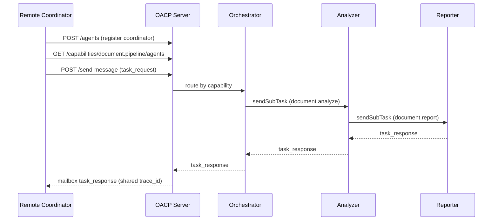

# Demo v1 — Network Collaboration (Day 14)

Week 2 capstone: three agents collaborate over **HTTP** with registry discovery,
capability routing, reliable delivery, and a shared `trace_id`.

## Run it

```bash
pnpm install
pnpm build
pnpm --filter oacp-examples start:demo
```

Smoke verification (CI-friendly):

```bash
pnpm --filter oacp-examples start:demo -- --verify
```

## Scenario

**Document incident triage** — a remote coordinator submits an incident document. Server-side
agents process it in a chain:

| Agent            | Capability          | Role                                    |
| ---------------- | ------------------- | --------------------------------------- |
| Orchestrator (A) | `document.pipeline` | Accepts document, delegates to analyzer |
| Analyzer (B)     | `document.analyze`  | Parses incident, delegates to reporter  |
| Reporter (C)     | `document.report`   | Produces structured report              |

Input:

```json
{ "document": "  INC-1042: latency spike in payment API  " }
```

Output:

```json
{
  "incident_id": "INC-1042",
  "severity": "high",
  "summary": "Latency spike in payment API",
  "report": "INC-1042 — Latency spike in payment API (severity: high)"
}
```

## Architecture



All hops share one `trace_id` for correlation. The coordinator is **outside** the server
process — it only speaks HTTP, like a real remote client.

## Week 2 feature map

| Day | Feature exercised in Demo v1                       |
| --- | -------------------------------------------------- |
| 8   | HTTP server (`POST /send-message`, `POST /agents`) |
| 9   | `AgentClient.sendTask()` remote coordinator        |
| 10  | `findAgentsByCapability('document.pipeline')`      |
| 11  | Capability auto-routing (no explicit `to`)         |
| 12  | Client timeouts and delivery retries               |
| 13  | `sendSubTask` chain A → B → C                      |
| 14  | Integrated runnable demo + docs                    |

## Sample output

```
[server] OACP node listening at http://127.0.0.1:54321
[server] Registered workers: orchestrator, analyzer, reporter
[coordinator] Discovered 1 agent(s) for document.pipeline
[coordinator] Task completed successfully

Output: {
  incident_id: 'INC-1042',
  severity: 'high',
  summary: 'Latency spike in payment API',
  report: 'INC-1042 — Latency spike in payment API (severity: high)'
}
Trace ID: 03e14011-584a-42f9-bcc9-232178aca04b
Responded by: agent://orchestrator

[trace] Timeline (6 messages):
  [task_request] agent://coordinator (capability: document.pipeline)
  [task_request] agent://orchestrator (capability: document.analyze)
  [task_request] agent://analyzer (capability: document.report)
  [task_response] agent://reporter (status: success)
  [task_response] agent://analyzer (status: success)
  [task_response] agent://orchestrator (status: success)

[demo] Week 2 milestone complete — agents collaborated over the network.
```

## Configuration

| Variable             | Default     | Description                |
| -------------------- | ----------- | -------------------------- |
| `OACP_HOST`          | `127.0.0.1` | Server bind host           |
| `OACP_PORT`          | `0`         | Listen port (`0` = random) |
| `OACP_TIMEOUT_MS`    | `15000`     | HTTP client timeout        |
| `OACP_DEMO_DOCUMENT` | see demo    | Override input document    |

## Tests

```bash
pnpm --filter @oacp/sdk test -- demo-v1.integration
```

## Source

- Demo script: [`examples/demo-v1/network-collaboration.ts`](../examples/demo-v1/network-collaboration.ts)
- Shared setup: [`examples/demo-v1/setup.ts`](../examples/demo-v1/setup.ts)
- Pipeline patterns: [multi-agent-pipeline.md](./multi-agent-pipeline.md)

## Next

Week 3 (Day 15+) adds persistent memory, delegation graphs, and observability tooling.
Demo v2 (Day 21) extends the team workflow with stored history and trace viewing.
