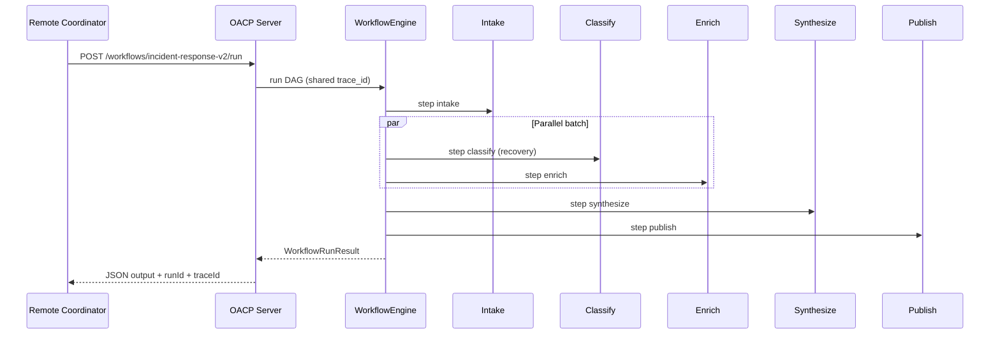

# Demo v2 — Structured Task Chain (Day 21)

Week 3 capstone: an **agent team completes a structured task chain** over HTTP using the
DAG workflow engine, shared memory, delegation graph, failure recovery, and trace
observability.

## Run it

```bash
pnpm install
pnpm build
pnpm --filter oacp-examples start:demo-v2
```

Smoke verification (CI-friendly):

```bash
pnpm --filter oacp-examples start:demo-v2 -- --verify
pnpm --filter oacp-examples start:demo-v2 -- --verify-recovery
pnpm --filter @oacp/sdk test -- demo-v2.integration
```

## Scenario

**Incident response pipeline** — a remote coordinator triggers a registered DAG workflow.
Six server-side agents execute a structured chain with a **parallel fan-out** after intake:

| Step       | Agent(s)                               | Capability            | Role                         |
| ---------- | -------------------------------------- | --------------------- | ---------------------------- |
| Intake     | Intake                                 | `incident.intake`     | Parse incident document      |
| Classify   | Classifier primary → backup (failover) | `incident.classify`   | Severity (Day 19 recovery)   |
| Enrich     | Enricher                               | `incident.enrich`     | Entity extraction (parallel) |
| Synthesize | Synthesizer                            | `incident.synthesize` | Merge classify + enrich      |
| Publish    | Publisher                              | `incident.publish`    | Final structured report      |

Input:

```json
{ "document": "  INC-2048: payment API latency spike affecting checkout  " }
```

Output:

```json
{
  "incident_id": "INC-2048",
  "severity": "high",
  "summary": "Payment API latency spike affecting checkout",
  "entities": ["payment API", "checkout"],
  "action_items": ["Scale payment API replicas", "Enable checkout fallback mode"],
  "report": "INC-2048 — Payment API latency spike affecting checkout (severity: high)",
  "recovery_used": false
}
```

Set `OACP_DEMO_V2_SIMULATE_FAILURE=1` (or use `--verify-recovery`) to exercise **alternate-agent
failover** on the classify step. Output includes `"recovery_used": true`.

## Architecture



All steps share one `trace_id`. Memory entries and the delegation graph are persisted on the
server for inspection via trace APIs.

## Week 3 feature map

| Day | Feature exercised in Demo v2                             |
| --- | -------------------------------------------------------- |
| 15  | `TaskMemoryRecorder` — task history in `MemoryStore`     |
| 16  | `DelegationGraphRecorder` — `GET /graph/traces/:traceId` |
| 17  | DAG step dependencies (`dependsOn`, parallel batches)    |
| 18  | `WorkflowEngine` — `POST /workflows/:id/run`             |
| 19  | `sendTaskWithRecovery` — classifier primary → backup     |
| 20  | Structured logging, trace timeline, `/trace-viewer`      |

## Environment variables

| Variable                        | Default         | Description                               |
| ------------------------------- | --------------- | ----------------------------------------- |
| `OACP_HOST`                     | `127.0.0.1`     | Server bind host                          |
| `OACP_PORT`                     | `0` (ephemeral) | Listen port                               |
| `OACP_TIMEOUT_MS`               | `30000`         | Client HTTP timeout                       |
| `OACP_DEMO_DOCUMENT`            | Demo incident   | Override input document                   |
| `OACP_DEMO_V2_SIMULATE_FAILURE` | (off)           | Primary classifier fails; backup recovers |
| `OACP_LOG_JSON`                 | (off)           | JSON structured logs from workers         |

## Inspect traces

With the server running:

```
http://127.0.0.1:<port>/playground?trace_id=<uuid>
http://127.0.0.1:<port>/trace-viewer?trace_id=<uuid>
pnpm --filter @oacp/server trace -- <trace-id>
```

For live agent topology, prefer the [playground](./playground.md).

Memory and graph:

```
GET /memory/traces/:traceId
GET /graph/traces/:traceId
GET /workflows/runs/:runId
```

## SDK usage

```typescript
import { AgentClient } from '@oacp/sdk';

const client = new AgentClient({ baseUrl: 'http://127.0.0.1:3847' });

const result = await client.runWorkflow('incident-response-v2', {
  document: 'INC-2048: payment API latency spike affecting checkout',
});

if (result.ok) {
  console.log(result.output);
  console.log(result.traceId);
}
```

## Related docs

- [Demo v1](./demo-v1.md) — Week 2 network collaboration capstone
- [Workflow engine](./workflow-engine.md) — DAG definitions and run records
- [Failure recovery](./failure-recovery.md) — alternate-agent failover
- [Observability](./observability.md) — trace viewer and structured logging
- [Memory system](./memory-system.md) — persistent task history
