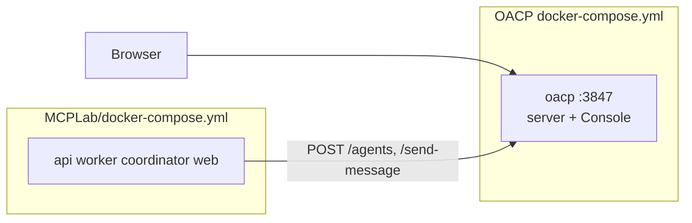

# Docker Compose — OACP unified stack (Day 51)

One-command deployment for **OACP v1 reference server + Console** — the launch path for MCPLab demos and external reviewers.

## Quick start (< 5 minutes)

**Prerequisites:** Docker Engine 24+ with Compose v2, Git.

```bash
git clone https://github.com/naaa-G/OACP.git
cd OACP
docker compose up --build -d
```

Open **http://127.0.0.1:3847/console/** — the OACP Console loads with live observability APIs.

### Seed a MCPLab-style demo trace (no MCPLab repo required)

```bash
docker compose --profile demo up --build
```

The `seed-demo` service registers five `fleet=mcplab` agents, sends a research-crew task, and prints a Console showcase URL.

### Full showcase with MCPLab

```bash
git clone https://github.com/naaa-G/MCPLab.git MCPLab
pnpm docker:mcplab
# or manually:
#   docker compose up -d --build
#   docker compose -f MCPLab/docker-compose.yml up -d --build
```

MCPLab connects to `http://oacp:3847` on the shared `oacp-network` — **no embedded OACP server**. Migrate legacy MCPLab Docker using [integrate/mcplab/MIGRATION.md](../integrate/mcplab/MIGRATION.md).

### Stop and reset

```bash
docker compose down          # keep SQLite volume
docker compose down -v         # wipe persisted traces/registry
```

## Architecture



MCPLab is an **optional client container** — it never bundles or starts its own OACP server. Legacy MCPLab images that embedded OACP on `:3001` must be migrated — see [integrate/mcplab/MIGRATION.md](../integrate/mcplab/MIGRATION.md).

| Component         | Path / port                      | Notes                                    |
| ----------------- | -------------------------------- | ---------------------------------------- |
| OACP API          | `http://127.0.0.1:3847`          | Protocol + observability v1              |
| Console           | `http://127.0.0.1:3847/console/` | Built React app from `apps/console/dist` |
| Health            | `GET /health`                    | Docker healthcheck + load balancers      |
| Snapshot          | `GET /v1/observability/snapshot` | Console data source                      |
| SSE               | `GET /v1/observability/events`   | Live feed transport                      |
| Legacy playground | `GET /playground`                | 302 → `/console/`                        |

## Compose layout

| File                                                        | Purpose                                       |
| ----------------------------------------------------------- | --------------------------------------------- |
| [`docker-compose.yml`](../docker-compose.yml)               | OACP platform + optional `demo` profile       |
| [`MCPLab/docker-compose.yml`](../MCPLab/docker-compose.yml) | Full MCPLab lab stack (client-only OACP)      |
| [`integrate/mcplab/`](../integrate/mcplab/)                 | Migration guide + minimal client-only compose |
| [`.env.example`](../.env.example)                           | Optional host ports and MCPLab URLs           |

Profiles:

| Profile            | Services                      | Use case                                                       |
| ------------------ | ----------------------------- | -------------------------------------------------------------- |
| _(default)_        | `oacp`                        | Platform + Console only                                        |
| `demo`             | `oacp`, `seed-demo`           | Quick MCPLab-style trace without MCPLab repo                   |
| _(MCPLab compose)_ | postgres, api, worker, web, … | Full lab — `pnpm docker:mcplab` or `MCPLab/docker-compose.yml` |

## Environment variables

### Published to host

| Variable                  | Default                         | Purpose                                          |
| ------------------------- | ------------------------------- | ------------------------------------------------ |
| `OACP_PUBLISH_PORT`       | `3847`                          | Host port mapped to container                    |
| `OACP_IMAGE_TAG`          | `latest`                        | Image tag for `oacp/server-console`              |
| `OACP_PUBLIC_URL`         | `http://127.0.0.1:3847`         | Host-reachable URL in seed-demo output           |
| `MCPLAB_PUBLISH_PORT`     | `8080`                          | Host port for minimal MCPLab client-only compose |
| `MCPLAB_OACP_CONSOLE_URL` | `http://127.0.0.1:3847/console` | Browser deep links from MCPLab                   |

### Container runtime (`oacp` service)

| Variable                  | Default                  | Purpose                             |
| ------------------------- | ------------------------ | ----------------------------------- |
| `OACP_SERVER_HOST`        | `0.0.0.0`                | Bind address                        |
| `OACP_SERVER_PORT`        | `3847`                   | Listen port                         |
| `OACP_MEMORY_BACKEND`     | `sqlite`                 | `sqlite`, `memory`, or `postgres`   |
| `OACP_MEMORY_SQLITE_PATH` | `/data/memory.db`        | Persisted registry + traces         |
| `OACP_CONSOLE_DIST`       | `/app/apps/console/dist` | Console static assets               |
| `OACP_CONSOLE_STATIC`     | `1`                      | Set `0` to disable `/console` mount |
| `OACP_SERVER_LOG_LEVEL`   | `info`                   | Fastify log level                   |

Optional SSE fanout (multi-instance): `OACP_OBSERVABILITY_REDIS_URL`, `OACP_OBSERVABILITY_REDIS_CHANNEL`.

Full reference: [http-server.md](./http-server.md).

## Health checks

The `oacp` service healthcheck calls `GET /health` every 10s. Dependent services (`seed-demo`) use `condition: service_healthy`. MCPLab services wait via `oacp-platform-wait` in `MCPLab/docker-compose.yml`.

Manual check:

```bash
curl -s http://127.0.0.1:3847/health | jq .
curl -sI http://127.0.0.1:3847/console/ | head
```

## Image build

Multi-stage [`Dockerfile`](../Dockerfile):

1. **build** — `pnpm install --frozen-lockfile` + `pnpm build` (Console → server via Turborepo)
2. **runtime** — Node 20 slim, non-root `node` user, `tini` init, SQLite volume at `/data`

Local rebuild:

```bash
docker compose build --no-cache oacp
```

## MCPLab environment migration (Day 51)

| Legacy                                         | v1 unified stack                               |
| ---------------------------------------------- | ---------------------------------------------- |
| MCPLab embeds OACP on `:3001`                  | **Removed** — single `oacp` service on `:3847` |
| `MCPLAB_OACP_SERVER_URL=http://127.0.0.1:3001` | `http://127.0.0.1:3847`                        |
| Separate Console dev server `:5173`            | `http://127.0.0.1:3847/console`                |
| Playground HTML                                | Redirect only → Console                        |

Migrate MCPLab using [integrate/mcplab/MIGRATION.md](../integrate/mcplab/MIGRATION.md).

## Troubleshooting

| Symptom                      | Fix                                                                                        |
| ---------------------------- | ------------------------------------------------------------------------------------------ |
| Console 404                  | Rebuild image — `apps/console/dist` must exist in image (`pnpm build` in Dockerfile)       |
| Healthcheck failing          | `docker compose logs oacp`; allow 45s start period on first boot                           |
| `better-sqlite3` errors      | Rebuild image on same platform as runtime (use published image, not cross-arch bind mount) |
| MCPLab cannot reach OACP     | Shared compose: `http://oacp:3847`; standalone MCPLab: `host.docker.internal:3847`         |
| `MCPLab directory not found` | Clone to `./MCPLab` or use `docker compose --profile demo`                                 |
| MCPLab still starts :3001    | Follow [MIGRATION.md](../integrate/mcplab/MIGRATION.md) — remove embedded server           |
| Empty agent list             | Run `docker compose --profile demo up` or start an MCPLab crew                             |

## Related

- [development.md](./development.md) — local pnpm workflow
- [mcplab-integration.md](./mcplab-integration.md) — fleet/role metadata + Console URLs
- [mcplab-full-loop.md](./mcplab-full-loop.md) — integration contract
- [version1.md](./version1.md) — Day 51 acceptance criteria
