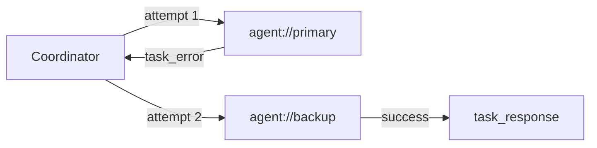

# Failure recovery (Day 19)

Day 19 adds **resilient task routing**: when a worker fails (error response, timeout, or routing failure), OACP can **retry** or **fail over to alternate agents** and **fallback capabilities** — without losing `trace_id` correlation.

This complements:

- [Reliable delivery](./reliable-delivery.md) (Day 12) — HTTP transport retries (`at-least-once`)
- [Capability routing](./capability-routing.md) (Day 11) — primary agent selection
- [Workflow engine](./workflow-engine.md) (Day 18) — DAG step execution

## Concepts

| Term                    | Meaning                                                                    |
| ----------------------- | -------------------------------------------------------------------------- |
| **TaskRecoveryPolicy**  | Max attempts, backoff, retryable error codes, fallback agents/capabilities |
| **Failover**            | Try the next registered agent for the same capability                      |
| **Fallback capability** | Degrade to an alternate capability (e.g. premium → standard)               |
| **Recovery attempts**   | Audit trail of each try (agent, outcome, error code)                       |



## Quick start

```typescript
import {
  createAgentRuntime,
  createMessageBus,
  sendTaskWithRecovery,
  DEFAULT_TASK_RECOVERY_POLICY,
} from '@oacp/core';

const outcome = await sendTaskWithRecovery(
  coordinator,
  {
    capability: 'text.summarize',
    input: { text: 'quarterly report' },
  },
  {
    policy: DEFAULT_TASK_RECOVERY_POLICY,
  },
);

if (outcome.ok) {
  console.log(outcome.selectedAgent, outcome.response?.output);
  console.log(outcome.recoveryAttempts);
}
```

### SDK

```typescript
import { Agent, LocalBus, DEFAULT_TASK_RECOVERY_POLICY } from '@oacp/sdk';

const outcome = await coordinator.agentRuntime.sendTaskWithRecovery(
  { capability: 'text.summarize', input: { text: 'demo' } },
  { policy: DEFAULT_TASK_RECOVERY_POLICY },
);
```

## TaskRecoveryPolicy

| Field                          | Default                   | Description                                     |
| ------------------------------ | ------------------------- | ----------------------------------------------- |
| `maxAttemptsPerAgent`          | `1`                       | Retries on the same agent before failover       |
| `maxTotalAttempts`             | unlimited                 | Cap across all agents                           |
| `retryBackoffMs`               | `0`                       | Delay between same-agent retries                |
| `retryableTaskErrorCodes`      | all task errors           | Filter which handler errors retry on same agent |
| `retryableTransportErrorCodes` | transient routing/runtime | Timeout, no recipient, delivery failed          |
| `fallbackCapabilities`         | `[]`                      | Capabilities tried after primary pool exhausted |
| `fallbackAgents`               | —                         | Explicit agent order (skips capability index)   |
| `excludeFailedAgents`          | `true`                    | Do not retry agents that already failed         |

Agents sharing a capability are tried in **sorted URI order**. Use numeric prefixes (`agent://worker-01`, `agent://worker-02`) or explicit `fallbackAgents` to control priority.

## Fallback capabilities

```typescript
await sendTaskWithRecovery(
  coordinator,
  {
    capability: 'text.summarize.premium',
    input: { text: 'report' },
  },
  {
    policy: {
      fallbackCapabilities: ['text.summarize.standard'],
    },
  },
);
```

## Workflows and subtask plans

Pass a default recovery policy to workflows and subtask execution:

```typescript
await engine.run('my-workflow', coordinator, input, {
  recovery: { excludeFailedAgents: true },
});

await ctx.executePlan(plan, {
  recovery: { maxAttemptsPerAgent: 2, retryBackoffMs: 100 },
});
```

Per-step overrides on `SubtaskPlanStep`:

```typescript
{
  id: 'summarize',
  capability: 'text.summarize.premium',
  fallbackCapabilities: ['text.summarize.standard'],
  recovery: { maxAttemptsPerAgent: 2 },
}
```

Step results include `recoveryAttempts` when failover was used.

## Error codes

| Code                         | When                                        |
| ---------------------------- | ------------------------------------------- |
| `RUNTIME_RECOVERY_EXHAUSTED` | All agents and fallback capabilities failed |

## Day 12 vs Day 19

| Layer       | Day 12                              | Day 19                                        |
| ----------- | ----------------------------------- | --------------------------------------------- |
| Scope       | HTTP `POST /send-message` transport | In-process task execution                     |
| Guarantee   | `at-least-once` network delivery    | Best-effort alternate agent                   |
| Trigger     | Network 5xx, timeout                | Handler error, routing failure, agent timeout |
| Idempotency | Client re-sends same `message_id`   | New `task_request` per attempt                |

Use **both** in production: Day 12 for remote ingress, Day 19 for orchestrator failover across worker pools.

## Runnable example

```bash
pnpm --filter oacp-examples start:recovery
```

## Related

- [Reliable delivery](./reliable-delivery.md)
- [Capability routing](./capability-routing.md)
- [Workflow engine](./workflow-engine.md)
- [Subtask decomposition](./subtask-decomposition.md)
