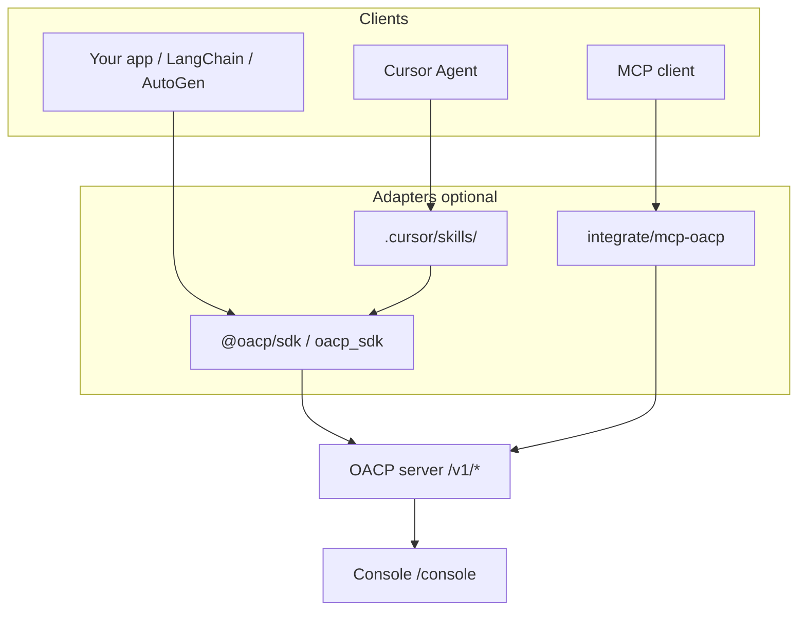

# Integration surfaces

How to connect **any AI runtime, IDE, or application** to OACP v1.0. These are **different layers** — pick the one that matches your client.

## Do not build a second universal API

OACP **already is** the universal runtime layer:

- HTTP `/v1/*` and `/agents`, `/send-message`
- TypeScript SDK (`@oacp/sdk`) and Python SDK (`oacp_sdk`)
- OACP Console at `/console` for observability

Cursor skills and MCP tools are **onboarding adapters** — they teach or expose the same API, not replace it.

## Comparison

| Surface              | Format                 | Works with                                      | Purpose                             |
| -------------------- | ---------------------- | ----------------------------------------------- | ----------------------------------- |
| **SDK / HTTP**       | npm, PyPI, REST        | Any language, LangChain, AutoGen, custom agents | Production integration              |
| **Docker**           | `docker compose up`    | Local dev, demos, CI                            | Platform + Console in one container |
| **MCP tools server** | stdio MCP              | Claude Desktop, Cursor MCP, MCP clients         | Tool calls without writing SDK code |
| **Cursor skills**    | `SKILL.md`             | Cursor Agent only                               | Step-by-step wiring in the IDE      |
| **MCPLab**           | Python lab + MCP tools | Reference implementation                        | Flagship MCP × OACP demo            |

## When to use which

### SDK / HTTP (default)

Use for **production** and the **15-minute adoption test**:

1. `docker compose up -d`
2. `pnpm --filter oacp-examples start:custom-agents`
3. Open the printed Console URL

Guide: [bring-your-own-agents.md](./bring-your-own-agents.md)

### Docker

Use when you want OACP + Console without installing Node/Python toolchains on the host.

Guide: [docker-compose.md](./docker-compose.md)

### MCP tools server

Use when your AI client speaks **MCP** but you do not want to embed the SDK in application code.

Location: [integrate/mcp-oacp/README.md](../integrate/mcp-oacp/README.md)

Tools: `oacp_health`, `oacp_register_agent`, `oacp_send_task`, `oacp_console_url`

### Cursor skills

Use when developing **inside Cursor** and you want the agent to follow OACP wiring conventions.

Locations:

- [integrate/skills/oacp-observability/](../integrate/skills/oacp-observability/SKILL.md)
- [integrate/skills/mcplab-demo/](../integrate/skills/mcplab-demo/SKILL.md)
- In-repo discovery: [.cursor/skills/](../.cursor/skills/)

Skills do **not** run on ChatGPT, Claude web, or generic cloud APIs unless you paste the instructions manually.

### MCPLab (flagship, optional)

Use to demonstrate **MCP tool servers + multi-agent crews** — not required for basic adoption.

Guide: [mcplab.md](./mcplab.md)

## Environment variables (common)

| Variable                            | Purpose                                                   |
| ----------------------------------- | --------------------------------------------------------- |
| `OACP_SERVER_URL` / `OACP_BASE_URL` | HTTP API base (default `http://127.0.0.1:3847` in Docker) |
| `OACP_API_KEY`                      | Bearer token when auth enabled                            |
| `OACP_PUBLIC_URL`                   | Host-reachable URL for Console links                      |
| `VITE_OACP_CONSOLE_FLEETS`          | JSON fleet labels at Console build time                   |

## Related

- [distribution.md](./distribution.md) — npm/PyPI/Docker/skills packages
- [integrations.md](./integrations.md) — LangChain and AutoGen adapters
- [integrate/README.md](../integrate/README.md) — adoption kit index
