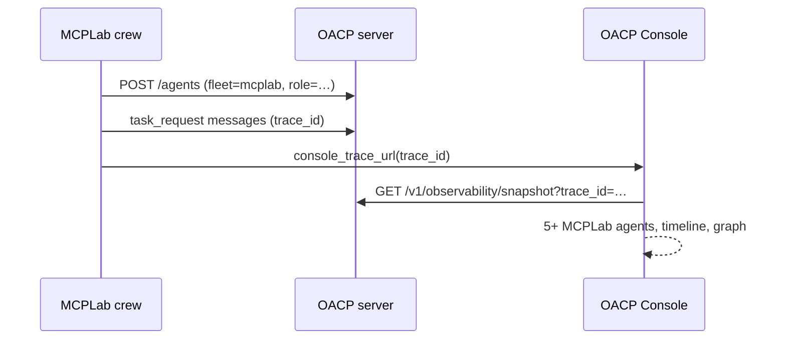

# MCPLab full-loop × Console verification (Day 15)

End-to-end contract for MCPLab research crews against the **OACP Console** and **`GET /v1/observability/snapshot`**. This closes Week 3: MCPLab is wired to Console, not the legacy playground.

## What “full loop” means



| Step              | Assertion                                                |
| ----------------- | -------------------------------------------------------- |
| Crew completes    | Artifact or structured output (MCPLab repo)              |
| Console URL       | `/console/?trace_id=<uuid>&mode=showcase`                |
| Snapshot API      | HTTP 200 on **v1** path (not legacy-only)                |
| Registered agents | ≥5 with `fleet: "mcplab"` and `role`                     |
| Active trace      | `active_trace.trace_id` matches; timeline ≥1 message     |
| Console UI        | Agent list + message flow + graph (manual or Playwright) |

## SDK helpers (OACP monorepo)

### Python (`oacp_sdk`)

```python
from oacp_sdk import (
    console_trace_url,
    fetch_observability_snapshot,
    validate_mcplab_console_loop,
    assert_mcplab_console_snapshot,
)

# After a crew run:
url = console_trace_url("http://127.0.0.1:3001", trace_id)
snapshot = validate_mcplab_console_loop(
    "http://127.0.0.1:3001",
    trace_id,
    console_base_url="http://127.0.0.1:5173",  # Vite dev Console
)
```

| Function                           | Purpose                                          |
| ---------------------------------- | ------------------------------------------------ |
| `fetch_observability_snapshot()`   | `GET /v1/observability/snapshot`                 |
| `assert_console_trace_url()`       | Validates Console deep-link format               |
| `assert_mcplab_console_snapshot()` | Snapshot contract (fleet, role, trace, timeline) |
| `validate_mcplab_console_loop()`   | URL + fetch + assert (one call)                  |

### TypeScript (`@oacp/sdk`)

```typescript
import { buildConsoleTraceUrl, registerMcplabAgent } from '@oacp/sdk';
```

## Automated tests

### OACP CI (always runs)

| Suite             | Path                                            |
| ----------------- | ----------------------------------------------- |
| Server contract   | `server/tests/mcplab-full-loop.test.ts`         |
| Python unit       | `sdk/python/tests/test_observability.py`        |
| Python trace URLs | `sdk/python/tests/test_mcplab_trace_url.py`     |
| TS trace URLs     | `sdk/typescript/tests/mcplab-trace-url.test.ts` |

```bash
pnpm --filter @oacp/server test -- mcplab-full-loop
cd sdk/python && pip install -e ".[dev]" && pytest tests/test_observability.py tests/test_mcplab_trace_url.py -v
pnpm --filter @oacp/sdk test -- mcplab
```

### Live integration (optional)

Reference implementation: `sdk/python/tests/integration/test_full_loop.py`

MCPLab should mirror this as `MCPLab/tests/integration/test_full_loop.py` importing `validate_mcplab_console_loop` from `oacp_sdk`.

```bash
# Terminal 1 — OACP (MCPLab Docker or local server)
# MCPLab Docker: http://127.0.0.1:3001

# Terminal 2 — Console dev (optional, for manual UI check)
pnpm --filter @oacp/console dev

# Terminal 3 — live integration test
cd sdk/python
pip install -e ".[dev]"
export MCPLAB_OACP_SERVER_URL=http://127.0.0.1:3001
export MCPLAB_OACP_CONSOLE_URL=http://127.0.0.1:5173
pytest tests/integration/test_full_loop.py -m integration -v
```

**Windows PowerShell** (use `$env:` instead of `export`):

```powershell
cd sdk/python
pip install -e ".[dev]"
$env:MCPLAB_OACP_SERVER_URL = "http://127.0.0.1:3001"
$env:MCPLAB_OACP_CONSOLE_URL = "http://127.0.0.1:5173"
pytest tests/integration/test_full_loop.py -m integration -v
```

**After a real MCPLab research crew run**, pin the trace:

```bash
export MCPLAB_FULL_LOOP_TRACE_ID=<uuid-from-crew-output>
pytest tests/integration/test_full_loop.py -m integration -v
```

Without `MCPLAB_FULL_LOOP_TRACE_ID`, the test seeds five MCPLab agents and one `task_request` against the live server (requires `POST /agents` access).

## Manual verification checklist

1. Start MCPLab Docker (`:3001`) and Console dev (`:5173`).
2. Set `MCPLAB_OACP_CONSOLE_URL=http://127.0.0.1:5173`.
3. Run MCPLab research crew — note `console=` URL in output.
4. Open URL — expect `mode=showcase` (or `mode=legacy` for ring graph during Week 3).
5. In Console:
   - **Registered agents**: ≥5 MCPLab agents with cyan fleet badge + role pills
   - **Message flow**: timeline entries for the trace
   - **Delegation graph**: nodes for registered agents (legacy ring)
6. Stop OACP — Console shows offline empty states (Day 14); restart — data returns.

## Environment variables

| Variable                    | Default                 | Purpose                                   |
| --------------------------- | ----------------------- | ----------------------------------------- |
| `MCPLAB_OACP_SERVER_URL`    | `http://127.0.0.1:3001` | OACP API for snapshot fetch               |
| `MCPLAB_OACP_CONSOLE_URL`   | _(derived from server)_ | Browser Console base (Vite `:5173`)       |
| `MCPLAB_FULL_LOOP_TRACE_ID` | _(unset)_               | Use existing trace instead of seeding     |
| `OACP_SERVER_URL`           | —                       | Alias for server URL in integration tests |

## MCPLab repository wiring

Copy this doc to `MCPLab/docs/oacp-integration.md` (see [mcplab-integration.md](./mcplab-integration.md)).

Minimum `test_full_loop.py` in MCPLab:

```python
from oacp_sdk import validate_mcplab_console_loop

def test_research_crew_console_loop(research_crew_result, oacp_server_url, console_base_url):
    validate_mcplab_console_loop(
        oacp_server_url,
        research_crew_result.trace_id,
        console_base_url=console_base_url,
        min_mcplab_agents=5,
    )
```

## Day 15 acceptance log

| Criterion                                   | Status      | Evidence                                            |
| ------------------------------------------- | ----------- | --------------------------------------------------- |
| MCPLab research crew → artifact + trace     | ✅ Contract | `validate_mcplab_console_loop` + server seed test   |
| Console trace with 5+ MCPLab agents visible | ✅          | `mcplab-full-loop.test.ts`, snapshot assert         |
| Integration test vs v1 snapshot API         | ✅          | `OBSERVABILITY_SNAPSHOT_PATH` required              |
| Console URL assertion                       | ✅          | `assert_console_trace_url` / `buildConsoleTraceUrl` |
| Week 3 — MCPLab wired to Console            | ✅          | Deep links Day 12 + full-loop Day 15                |

_Verified: 2026-06-20 — OACP monorepo CI suites green._

## Related

- [mcplab-integration.md](./mcplab-integration.md) — registration contract + role taxonomy
- [console.md](./console.md) — Console dev workflow
- [console-spec.md](./console-spec.md) — snapshot schema
- [integration-testing.md](./integration-testing.md) — broader test matrix
- [version1.md](./version1.md) — 60-day plan
