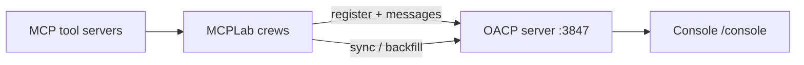

# MCPLab × OACP

**MCPLab** is the flagship **MCP × OACP** reference lab: MCP connects agents to tools; OACP connects agents to each other. The **OACP Console** is the launch observability surface.

## Quick start

```bash
pnpm docker:mcplab
```

| Surface                 | URL                                          |
| ----------------------- | -------------------------------------------- |
| OACP Console (Showcase) | http://127.0.0.1:3847/console/?mode=showcase |
| MCPLab web              | http://127.0.0.1:3002 (port may vary)        |
| MCPLab API              | http://127.0.0.1:8001/docs                   |

Demo without live LLM:

```bash
pnpm demo:fallback
```

Presenter scripts: [demo-scripts.md](./demo-scripts.md)

## Architecture



MCPLab is an **OACP client** in v1 — it does not embed its own OACP server. See [integrate/mcplab/MIGRATION.md](../integrate/mcplab/MIGRATION.md) if upgrading from legacy `:3001` embedded stacks.

## Agent contract

Every MCPLab agent registers with:

```json
{
  "metadata": {
    "fleet": "mcplab",
    "role": "planner"
  }
}
```

Full taxonomy: [mcplab-integration.md](./mcplab-integration.md)

## Observability sync (Day 53)

| Store           | Role                                            |
| --------------- | ----------------------------------------------- |
| MCPLab Postgres | Crew run history, export payloads               |
| OACP SQLite     | Live registry, traces, Console snapshot source  |
| Sync worker     | Push on run complete + backfill on OACP startup |

Data model: [mcplab-oacp-data-model.md](./mcplab-oacp-data-model.md)

### Sync troubleshooting

| Symptom                                 | Action                                                                                                |
| --------------------------------------- | ----------------------------------------------------------------------------------------------------- |
| **Console empty after OACP recreate**   | Check MCPLab sync logs; verify `MCPLAB_SYNC_SECRET`, `MCPLAB_OACP_API_KEY`; wait for startup backfill |
| **Open Console link 404 / empty trace** | Confirm `trace_id` exists in MCPLab Postgres; run `mcplab sync-oacp` or restart unified stack         |
| **Intentional history wipe**            | `docker compose down -v` on **both** OACP and MCPLab stacks                                           |
| **401 on observability API**            | Align `OACP_API_KEY` and `MCPLAB_OACP_API_KEY`                                                        |

Smoke tests: `pnpm test:day55`, `server/tests/mcplab-startup-sync.test.ts`

## Three flagship crews

| Crew       | Console mode | Fallback trace                         |
| ---------- | ------------ | -------------------------------------- |
| Research   | Showcase     | `d5610001-0001-4000-8000-000000000001` |
| Code patch | Showcase     | `d5610002-0002-4000-8000-000000000002` |
| Ops        | Ops          | `d5610003-0003-4000-8000-000000000003` |

## Integration docs

| Doc                                                      | Topic                              |
| -------------------------------------------------------- | ---------------------------------- |
| [mcplab-integration.md](./mcplab-integration.md)         | Registration contract, SDK helpers |
| [mcplab-full-loop.md](./mcplab-full-loop.md)             | End-to-end verification            |
| [mcplab-oacp-data-model.md](./mcplab-oacp-data-model.md) | Sync direction and failure modes   |
| [docker-compose.md](./docker-compose.md)                 | Unified stack                      |
| [integrate/mcplab/](../integrate/mcplab/)                | Client-only templates              |

## Bring your own agents (without MCPLab)

MCPLab proves the full MCP story; integrators can skip it:

[bring-your-own-agents.md](./bring-your-own-agents.md)

## Related

- [integration-surfaces.md](./integration-surfaces.md)
- [console.md](./console.md)
