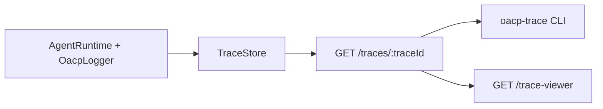

# Observability (Day 20)

OACP Week 3 Day 20 adds **structured logging** and a **trace viewer** so you can inspect multi-agent work end-to-end — correlated by `trace_id`, with message timelines and delegation graph context.

This complements:

- [Message bus](./message-bus.md) — in-process `TraceStore`
- [Delegation graph](./delegation-graph.md) — who delegated what
- [Memory system](./memory-system.md) — persisted task history

## Concepts

| Term            | Meaning                                                           |
| --------------- | ----------------------------------------------------------------- |
| **Trace**       | All protocol messages sharing one `trace_id`                      |
| **Timeline**    | Ordered, human-readable view of messages in a trace               |
| **TraceBundle** | Messages + timeline + optional graph and memory entries           |
| **OacpLogger**  | Structured logger with `trace_id`, `agent_id`, correlation fields |



## Structured logging

Pass an `OacpLogger` to `AgentRuntime` or SDK `Agent`. Task lifecycle events are logged automatically:

```typescript
import { createAgentRuntime, createConsoleLogger, createMessageBus } from '@oacp/core';

const logger = createConsoleLogger({
  level: 'info',
  json: true, // JSON lines for log aggregators (Datadog, ELK, CloudWatch)
});

const worker = createAgentRuntime({
  identity: workerIdentity,
  bus: createMessageBus(),
  logger,
  onTask: async (task) => ({ output: { done: true } }),
});
```

Logged events:

| Event                 | Level | Context fields                         |
| --------------------- | ----- | -------------------------------------- |
| `task received`       | info  | `trace_id`, `message_id`, `capability` |
| `task completed`      | info  | `trace_id`, `message_id`, `status`     |
| `task handler failed` | error | `trace_id`, `message_id`, `error`      |
| `sendTask dispatched` | info  | `trace_id`, `message_id`, `capability` |
| `sendTask failed`     | warn  | `trace_id`, `message_id`, `error`      |

Use `logger.child({ agent_id })` for nested components. `noopLogger` is the default when no logger is configured.

## Trace timeline (in-process)

```typescript
import { buildTraceTimeline, formatTraceTimeline, buildTraceBundleFromRecord } from '@oacp/core';

const record = bus.getTrace(traceId);
const bundle = buildTraceBundleFromRecord(record!);
console.log(formatTraceTimeline(bundle.timeline, { graph: bundle.graph }));
```

## HTTP API (`@oacp/server`)

| Endpoint               | Description                                   |
| ---------------------- | --------------------------------------------- |
| `GET /traces`          | List active traces from the in-process bus    |
| `GET /traces/:traceId` | Full trace bundle (messages, timeline, graph) |
| `GET /trace-viewer`    | Lightweight web UI for browsing traces        |

### List traces

```
GET /traces?limit=25&offset=0
```

```json
{
  "ok": true,
  "traces": [
    {
      "traceId": "0c8f1e2a-7b3d-4f9e-9b1a-2d4e6f8a0c1b",
      "startedAt": "2026-06-13T10:00:00.000Z",
      "lastActivityAt": "2026-06-13T10:00:01.200Z",
      "messageCount": 4,
      "messageTypes": ["task_request", "task_response"],
      "agents": ["agent://coordinator", "agent://worker"]
    }
  ],
  "count": 1,
  "total": 1
}
```

### Trace detail

```
GET /traces/:traceId
```

Returns a `TraceBundle` with `messages`, `timeline`, and optional `graph` / `memory_entries`. When the bus has been restarted, the server reconstructs the timeline from the delegation graph stored in memory.

## CLI trace viewer

```bash
pnpm build

# Start the reference server (separate terminal)
pnpm --filter @oacp/server start

# After a task runs, inspect its trace
pnpm --filter @oacp/server trace -- <trace-id>

# List recent traces
pnpm --filter @oacp/server trace -- --list

# JSON output for scripts
pnpm --filter @oacp/server trace -- <trace-id> --format json
```

Environment:

| Variable        | Default                 | Purpose            |
| --------------- | ----------------------- | ------------------ |
| `OACP_BASE_URL` | `http://127.0.0.1:3000` | Server URL for CLI |

Programmatic access via `TraceClient`:

```typescript
import { createTraceClient } from '@oacp/core';

const client = createTraceClient({ baseUrl: 'http://127.0.0.1:3000' });
const trace = await client.getTrace(traceId);
```

## Web trace viewer

With the reference server running:

```
http://127.0.0.1:3000/trace-viewer
http://127.0.0.1:3000/trace-viewer?trace_id=<uuid>
```

The viewer lists recent traces, shows a message timeline, and displays graph depth. For live agent topology and message flow, use the **playground** at `GET /playground` (Day 22).

## Runnable example

```bash
pnpm build
pnpm --filter oacp-examples start:trace
```

See `examples/observability/trace-viewer.ts` — structured logging + in-process timeline output.

Set `OACP_LOG_JSON=1` for JSON log lines.

## Enterprise usage

1. **Correlation** — always propagate `trace_id` from coordinator through subtasks and recovery attempts (Day 19).
2. **JSON logging** — enable `json: true` in production; ship logs to your aggregator with `trace_id` indexed.
3. **Non-fatal observability** — trace listing reads the in-process bus; memory and graph provide fallback after partial restarts.
4. **CLI in CI** — `--format json` on `oacp-trace` for smoke assertions on demo traces.
5. **Web viewer** — use behind auth in production; suitable for internal ops dashboards. For stakeholder demos, prefer [Playground](./playground.md).

## Related docs

- [Delegation graph](./delegation-graph.md)
- [Failure recovery](./failure-recovery.md)
- [HTTP server](./http-server.md)
- [Demo v1](./demo-v1.md)
