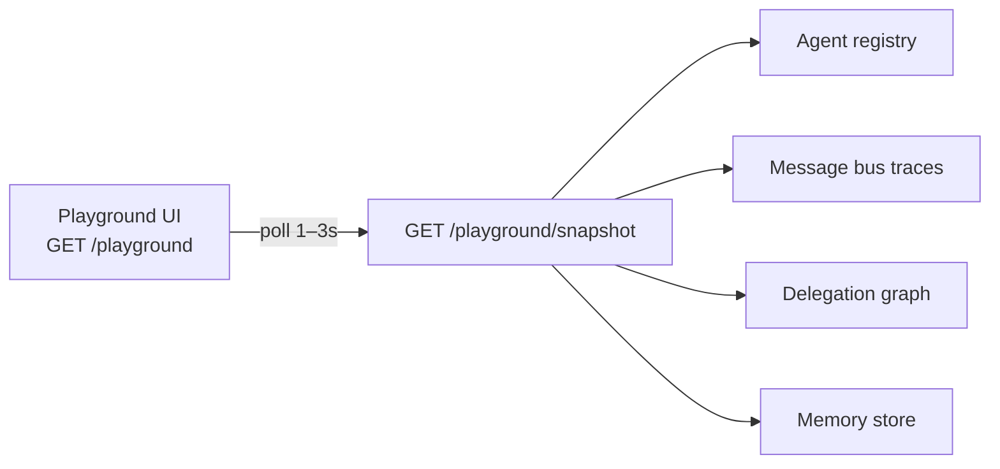

# Playground

The OACP **playground** is the primary adoption differentiator: a web UI that renders registered agents as nodes and animates message flow and delegation edges as collaboration happens.

## Architecture



The playground is **read-only observability** — it does not send tasks. Run demos or your own coordinators against the reference server; the UI reflects live state.

### vs trace viewer (Day 20)

| Feature                        | `/trace-viewer`    | `/playground`            |
| ------------------------------ | ------------------ | ------------------------ |
| Agent registry panel           | —                  | ✅                       |
| Delegation graph (agent nodes) | depth summary only | ✅ SVG topology          |
| Message timeline               | ✅                 | ✅ with live highlight   |
| Live polling                   | manual refresh     | ✅ configurable interval |
| Unified snapshot API           | multiple endpoints | ✅ single poll           |

Use the trace viewer for quick diagnostics; use the playground for demos and stakeholder visibility.

## Quick start

### All-in-one (recommended)

```bash
pnpm build
pnpm --filter oacp-examples start:playground
```

Boots the **Autonomous Startup Team** (Day 23), runs one workflow on start, and serves the
playground at `http://127.0.0.1:3000/playground`.

### Split terminals

```bash
# Terminal 1 — reference server
pnpm --filter @oacp/server start

# Terminal 2 — run a workload
pnpm --filter oacp-examples start:startup

# Browser
http://127.0.0.1:3000/playground?trace_id=<from-demo-output>
```

### Continuous demo loop

```bash
pnpm --filter oacp-examples start:playground -- --loop
```

Re-runs the startup team workflow every 20 seconds so the playground always has fresh traces.

## HTTP API

### `GET /playground`

Self-contained HTML UI (no build step). Query params:

| Param      | Purpose                    |
| ---------- | -------------------------- |
| `trace_id` | Pre-select a trace on load |

### `GET /playground/snapshot`

Unified poll endpoint for live refresh.

```
GET /playground/snapshot?trace_id=<uuid>&limit=25
```

```json
{
  "ok": true,
  "snapshot": {
    "server": {
      "status": "healthy",
      "protocol_version": "0.1",
      "registered_agents": 6,
      "bus_open": true
    },
    "agents": [{ "id": "agent://intake", "name": "...", "capabilities": ["incident.intake"] }],
    "traces": [{ "traceId": "...", "messageCount": 12, "agents": ["agent://intake"] }],
    "trace_count": 3,
    "active_trace": {
      "trace_id": "...",
      "message_count": 12,
      "timeline": [],
      "graph": { "nodes": [], "edges": [], "depth": 2 }
    },
    "agent_links": [
      {
        "from_agent": "agent://intake",
        "to_agent": "agent://classifier-01-primary",
        "kind": "subtask",
        "capability": "incident.classify",
        "message_count": 1
      }
    ]
  }
}
```

When `trace_id` is omitted, the UI auto-selects the most recent trace.

## Enterprise usage

1. **Read-only by default** — playground endpoints do not mutate state; safe for internal ops dashboards.
2. **Auth in production** — place `/playground` behind your reverse proxy or SSO; do not expose unauthenticated on public networks.
3. **Polling interval** — default 1.5s is suitable for demos; increase to 3–5s under load.
4. **Correlation** — deep-link with `?trace_id=` from coordinator logs or `oacp-trace` CLI output.
5. **Demo script** — use `start:playground -- --loop` for conference booths and recorded walkthroughs.

## Implementation

| Component         | Location                                         |
| ----------------- | ------------------------------------------------ |
| Snapshot builder  | `server/src/observability/playground-service.ts` |
| Web UI            | `server/src/observability/playground-html.ts`    |
| Routes            | `server/src/api/http/routes.ts`                  |
| Live demo example | `examples/playground/live-demo.ts`               |

## Related docs

- [Observability](./observability.md) — logging, trace viewer, `oacp-trace` CLI
- [Delegation graph](./delegation-graph.md) — edge kinds and graph API
- [Demo v2](./demo-v2.md) — recommended playground workload
- [HTTP server](./http-server.md) — full API reference
