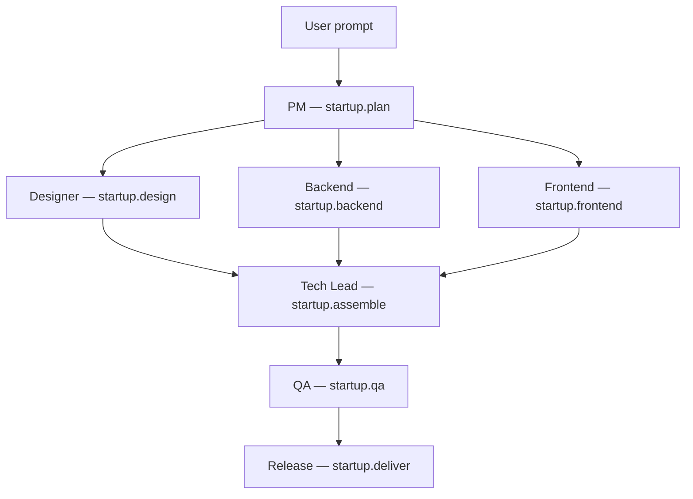

# Autonomous Startup Team (Day 23)

Week 4 **flagship demo**: a remote coordinator sends a product prompt; an agent team plans,
implements in parallel, assembles a repo scaffold, passes QA, and delivers — all observable
live in the [playground](./playground.md).

## Run it

```bash
pnpm install
pnpm build
pnpm --filter oacp-examples start:startup
```

Smoke verification (CI-friendly):

```bash
pnpm --filter oacp-examples start:startup -- --verify
pnpm --filter @oacp/sdk test -- startup-team.integration
```

### With the playground

```bash
pnpm --filter oacp-examples start:playground
# auto-runs one startup-team workflow, then open http://127.0.0.1:3000/playground

pnpm --filter oacp-examples start:playground -- --loop
# re-runs every 20s for continuous live demo
```

## Scenario

**Input prompt:**

```
Build a habit tracker app.
```

**Agent team:**

| Role      | Agent URI                   | Capability         |
| --------- | --------------------------- | ------------------ |
| PM        | `agent://startup-pm`        | `startup.plan`     |
| Designer  | `agent://startup-designer`  | `startup.design`   |
| Backend   | `agent://startup-backend`   | `startup.backend`  |
| Frontend  | `agent://startup-frontend`  | `startup.frontend` |
| Tech Lead | `agent://startup-tech-lead` | `startup.assemble` |
| QA        | `agent://startup-qa`        | `startup.qa`       |
| Release   | `agent://startup-deliverer` | `startup.deliver`  |

## Workflow DAG



Design, backend, and frontend execute **in parallel** after PM planning (same pattern as
Demo v2 classify ∥ enrich).

## Expected output

```json
{
  "project_slug": "habit-tracker",
  "project_name": "Habit Tracker",
  "prompt": "Build a habit tracker app.",
  "repo_structure": [
    "habit-tracker/README.md",
    "habit-tracker/package.json",
    "habit-tracker/src/api/routes.ts",
    "habit-tracker/src/pages/Dashboard.tsx",
    "habit-tracker/src/pages/HabitList.tsx",
    "habit-tracker/src/components/HabitCard.tsx",
    "habit-tracker/tests/smoke.test.ts"
  ],
  "repo_file_count": 7,
  "qa_status": "approved",
  "summary": "Habit Tracker — PM, Designer, Backend, Frontend, and QA delivered a full scaffold.",
  "agents_involved": ["pm", "designer", "backend", "frontend", "qa"]
}
```

## Architecture

```
Remote Coordinator (AgentClient)
        │
        ▼
   OACP Server (registry + workflow engine + traces)
        │
   PM → (Designer ∥ Backend ∥ Frontend) → Assemble → QA → Deliver
        │
        ▼
   Playground visualizes delegation graph + message flow
```

Integrates Week 3–4 capabilities:

| Day | Feature used                  |
| --- | ----------------------------- |
| 18  | DAG workflow engine           |
| 16  | Delegation graph              |
| 15  | Shared memory / task history  |
| 20  | Trace timeline                |
| 22  | Playground live visualization |

## Configuration

| Variable              | Default                      | Purpose          |
| --------------------- | ---------------------------- | ---------------- |
| `OACP_HOST`           | `127.0.0.1`                  | Bind address     |
| `OACP_PORT`           | `0` (ephemeral)              | Listen port      |
| `OACP_TIMEOUT_MS`     | `60000`                      | Client timeout   |
| `OACP_STARTUP_PROMPT` | `Build a habit tracker app.` | Product prompt   |
| `OACP_LOG_JSON`       | (off)                        | JSON worker logs |

Custom prompts produce a generic scaffold (slug derived from prompt text). The habit tracker
prompt is fully deterministic for CI and demos.

## SDK usage

```typescript
import { AgentClient } from '@oacp/sdk';

const client = new AgentClient({ baseUrl: 'http://127.0.0.1:3000' });

const result = await client.runWorkflow('autonomous-startup-v1', {
  prompt: 'Build a habit tracker app.',
});

if (result.ok) {
  console.log(result.output?.repo_structure);
  console.log(result.traceId);
}
```

## Enterprise notes

1. **Deterministic handlers** — no LLM in the reference demo; stable CI and reproducible playground recordings.
2. **Replace handlers with LLM agents** — same capabilities and workflow; swap `onTask` implementations or remote agents.
3. **Playground-first demos** — use `start:playground -- --loop` for stakeholder walkthroughs.
4. **Trace correlation** — one `trace_id` spans all seven steps; deep-link from logs to playground.
5. **QA gate** — deliver step requires `qa.status === approved`; extend with rejection/retry flows later.

## Related docs

- [Playground](./playground.md)
- [Demo v2](./demo-v2.md)
- [Workflow engine](./workflow-engine.md)
- [Delegation graph](./delegation-graph.md)
