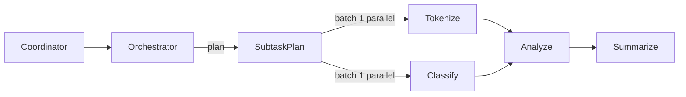

# Subtask decomposition (Day 17)

Day 17 adds **multi-step workflow decomposition**: an orchestrator agent breaks a parent task into subtasks, respects **dependencies**, and executes them via `sendSubTask` under one `trace_id`.

This builds on:

- [Multi-agent pipeline](./multi-agent-pipeline.md) — sequential `sendSubTask` chains (Day 13)
- [Delegation graph](./delegation-graph.md) — parent/child tracking (Day 16)

Day 18 adds a formal DAG **workflow engine** — see [workflow-engine.md](./workflow-engine.md). Day 17 is the **planning + execution** API orchestrator agents use inside task handlers.

## Concepts

| Term               | Meaning                                                                                  |
| ------------------ | ---------------------------------------------------------------------------------------- |
| **SubtaskPlan**    | Declarative list of steps with capabilities, inputs, and `dependsOn` edges               |
| **SubtaskPlanner** | Strategy that produces a plan from the parent task input (rules, templates, LLM adapter) |
| **Batch**          | Steps with satisfied dependencies that may run **in parallel**                           |
| **reduceOutput**   | Optional merge of step results into the final task output                                |



## Define a plan

```typescript
import type { SubtaskPlan } from '@oacp/core';

const plan: SubtaskPlan = {
  steps: [
    { id: 'tokenize', capability: 'text.tokenize', input: { text: 'hello world' } },
    {
      id: 'summarize',
      capability: 'text.summarize',
      dependsOn: ['tokenize'],
      mapInput: (ctx) => ({
        text: (ctx.getStepResult('tokenize')?.output?.tokens ?? []).join(' '),
      }),
    },
  ],
  reduceOutput: (ctx) => ({
    summary: ctx.getStepResult('summarize')?.output?.summary,
  }),
};
```

Each step requires **`input` or `mapInput`**. Dependencies reference other step `id` values and must be acyclic.

## Execute inside a task handler

```typescript
import { createAgentRuntime, createMessageBus } from '@oacp/core';

const orchestrator = createAgentRuntime({
  identity: orchestratorIdentity,
  bus,
  onTask: async (_task, ctx) => {
    const result = await ctx.executePlan(plan);
    if (!result.ok) {
      return { status: 'error', error: { code: 'WORKFLOW_FAILED', message: result.error.message } };
    }
    return { output: result.output };
  },
});
```

`executePlan` validates the plan, runs batches in order, and uses `sendSubTask` so the [delegation graph](./delegation-graph.md) records parent links.

## Plan dynamically with `SubtaskPlanner`

```typescript
import { createFunctionSubtaskPlanner } from '@oacp/core';

const planner = createFunctionSubtaskPlanner(({ input }) => ({
  steps: [
    {
      id: 'echo',
      capability: 'work.echo',
      input: { value: input.payload },
    },
  ],
}));

const result = await ctx.decomposeAndExecute({
  planner,
  onStepComplete: (step) => console.log(step.stepId, step.status),
});
```

Use `StaticSubtaskPlanner` for fixed workflows in tests.

## Validation and errors

`validateSubtaskPlan(plan)` checks:

- Non-empty steps with unique ids
- Valid `capability` and input/`mapInput`
- Known `dependsOn` references
- No dependency cycles (`WORKFLOW_PLAN_CYCLE`)

| Code                      | When                   |
| ------------------------- | ---------------------- |
| `WORKFLOW_PLAN_INVALID`   | Malformed plan         |
| `WORKFLOW_PLAN_CYCLE`     | Circular `dependsOn`   |
| `WORKFLOW_STEP_FAILED`    | Subtask returned error |
| `WORKFLOW_PLANNER_FAILED` | Planner threw          |

Execution uses **fail-fast** by default (`failFast: true`).

## Parallel batches

`planExecutionBatches(steps)` returns topological levels. Steps in the same batch have no dependencies on each other and run concurrently via `Promise.all`.

Example — tokenize and classify in parallel, then analyze:

```typescript
import { planExecutionBatches } from '@oacp/core';

const batches = planExecutionBatches(plan.steps);
// [['tokenize', 'classify'], ['analyze'], ['summarize']]
```

## Memory and observability

Record planning decisions alongside execution:

```typescript
await taskRecorder.recordDecision({
  trace_id: ctx.traceId,
  agent_id: ctx.agentId,
  decision: 'Decomposed into 4 subtasks',
});
```

Combine with `DelegationGraphRecorder` and `TaskMemoryRecorder` for full audit trails (see [memory system](./memory-system.md)).

## Comparison with `runPipeline`

| API                   | Who plans steps         | Dependencies      | Typical use                |
| --------------------- | ----------------------- | ----------------- | -------------------------- |
| `runPipeline`         | Coordinator / developer | Sequential only   | Fixed ETL-style chains     |
| `executePlan`         | Orchestrator agent      | DAG (`dependsOn`) | Agent-driven decomposition |
| `decomposeAndExecute` | `SubtaskPlanner`        | DAG               | Rules/LLM-generated plans  |

## Runnable example

```bash
pnpm build
pnpm --filter oacp-examples start:workflow
```

See `examples/workflow/subtask-decomposition.ts`.

## Related

- [Failure recovery](./failure-recovery.md) (Day 19)
- [Agent runtime](./agent-runtime.md) — `ExecutionContext` API
- [Delegation graph](./delegation-graph.md) — trace visualization
- [Multi-agent pipeline](./multi-agent-pipeline.md) — Day 13 sequential chains
