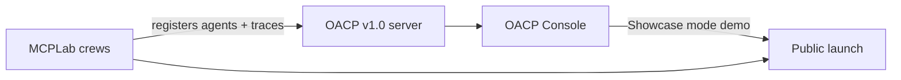
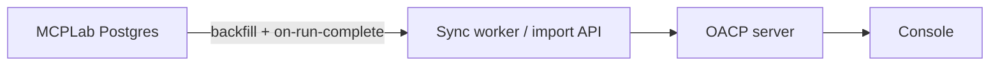

# OACP v1.0 — 60-Day Full Build Plan

**Project:** Open Agent Collaboration Protocol — v1.0 + OACP Console  
**Positioning:** _The first usable multi-agent collaboration system you can actually see working._  
**Stack:** TypeScript monorepo (`core`, `server`, `sdk`) + React Console (Three.js) + MCPLab (Python flagship demo)  
**Rule:** Ship **OACP v1.0 and MCPLab together**. MCPLab is the showcase; the old `/playground` is not part of the launch story.

---

## How to use this plan

- Each day has **one primary deliverable** and **acceptance criteria** — do not advance until criteria pass.
- Run **MCPLab crew traces** against the Console from Day 3 onward (not the legacy playground).
- MCPLab feature work is **done** — only integration wiring (metadata, URLs, Docker) appears in this plan.
- The legacy playground (`server/src/observability/playground-html.ts`) is **frozen** — redirect only; no new features.
- **Days 56–60** are joint launch — OACP `v1.0.0` and public MCPLab ship on the same day.
- **Days 61–70 (Phase 2)** are post-launch enterprise hardening — start only after v1.0 sign-off.

### Weekly milestones

| Week | Days  | Theme                             | Exit criterion                                                      |
| ---- | ----- | --------------------------------- | ------------------------------------------------------------------- |
| 1    | 1–5   | Console bootstrap                 | `apps/console` loads; design tokens applied                         |
| 2    | 6–10  | Observability API v2              | `/v1/observability/snapshot` powers Console shell                   |
| 3    | 11–15 | MCPLab integration + shell parity | MCPLab metadata live; Console replaces playground data view         |
| 4    | 16–20 | Agent catalog (core)              | Fleet/role grouping; trace-scoped default — **Issue #1**            |
| 5    | 21–25 | Agent catalog (advanced)          | Search, filters, cross-panel linking, detail drawer                 |
| 6    | 26–30 | Ops 2D graph                      | Hierarchical layout; hover labels; curved edges                     |
| 7    | 31–35 | Ops 2D graph (advanced)           | Zoom/pan, focus mode, trace replay scrubber — **Week 7 complete**   |
| 8    | 36–40 | Showcase 3D graph                 | Three.js sphere/force graph — **Issue #2 hero**                     |
| 9    | 41–45 | Showcase polish + presentation    | Bloom, fleet bands, full-screen demo — **Issue #2 closed Day 45**   |
| 10   | 46–50 | Message flow + SSE                | Smart tail, pause-on-hover — **Issue #3**                           |
| 11   | 51–55 | Platform hardening                | Docker, API key auth, persistence, **MCPLab↔OACP sync**, API freeze |
| 12   | 56–60 | Joint launch                      | OACP v1.0.0 + MCPLab public; demo video; README hero; adoption kit  |

**Phase 2 (Days 61–70)** begins after Day 60 sign-off. See [Phase 2 — Enterprise hardening](#phase-2--enterprise-hardening-days-6170).

---

## Launch strategy — unified release

OACP v1.0 and MCPLab publish **together**. MCPLab is not showcased on the old playground.



| Surface                               | Launch role                                                                                                                    |
| ------------------------------------- | ------------------------------------------------------------------------------------------------------------------------------ |
| **OACP Console** (`/console`)         | Primary observability UI — demos, README, video                                                                                |
| **Legacy playground** (`/playground`) | Redirect to `/console`; deprecated                                                                                             |
| **MCPLab**                            | Flagship proof: MCP tools + OACP orchestration                                                                                 |
| **Autonomous Startup Team**           | Secondary example in OACP examples gallery                                                                                     |
| **Bring-your-own agents** (SDK)       | Any project registers + traces via `@oacp/sdk` / `oacp_sdk` — Console is the viewer                                            |
| **Adoption kit** (Day 58)             | Docs, minimal example, integration-surfaces guide, Cursor skills, optional MCP adapter — lower friction than MCPLab-only story |

### MCPLab ↔ OACP observability sync (v1.0)

MCPLab Postgres (crew/run history) and OACP (live observability) are **related but distinct** until **Day 53 sync** wires them together. Console reads the **OACP server**; sync ensures OACP is **rehydrated** from MCPLab when stacks are recreated or drift apart.

| Store             | What it holds                                           | After Day 53 sync                                                             |
| ----------------- | ------------------------------------------------------- | ----------------------------------------------------------------------------- |
| MCPLab Postgres   | Crew runs, `trace_id`, stored message/trace payloads    | Source of record for orchestration history                                    |
| OACP SQLite + bus | Agents, traces, messages, registry (Day 53 persistence) | Target Console reads; **backfilled from MCPLab** on startup / on run complete |
| Console           | UI over OACP snapshot + SSE                             | Shows **live + synced** MCPLab crew traces                                    |

**v1.0 rule:** **Full observability sync** between MCPLab and OACP ships in Week 11 (Day 53). Recreating the `oacp` container must not orphan MCPLab Console links — sync job repopulates traces from MCPLab Postgres (or MCPLab pushes on crew completion).



**Sync scope (v1.0 minimum):**

- **MCPLab → OACP:** Re-import crew `trace_id`, agent registrations, and message timeline for each stored run so Console graphs/feeds render.
- **OACP → MCPLab:** Update run row with final trace status, message counts, and `console_url` when trace completes (status mirror).
- **Triggers:** OACP startup backfill (stale/missing traces); MCPLab worker after each crew run; optional `mcplab sync-oacp` CLI for manual repair.
- **Console filter (Day 58):** Trace rail toggle **Live only** vs **All synced** (default: all synced in Docker dev; live-only for noisy long-lived Postgres).

**Not in v1.0 sync scope:** Replacing MCPLab Postgres with OACP as orchestration DB; multi-tenant cross-lab federation (Phase 2).

### Bring your own agents (no Console “add agent” UI)

Integrators wire **their** agents to OACP via the SDK — registration + messaging — not via a Console form.

```text
User project agents  →  POST /agents + OACP messages  →  OACP server  →  Console
```

Custom `metadata.fleet` / `metadata.role` control catalog grouping (unknown fleets → **External** until registered in Console fleet config — Day 58).

### What we are fixing (known UI issues)

| #   | Issue                           | Root cause                        | Fixed by (day)                                        |
| --- | ------------------------------- | --------------------------------- | ----------------------------------------------------- |
| 1   | Agents indistinguishable        | Flat list, no fleet/role taxonomy | Days 16–25 (agent catalog) — **closed Day 25**        |
| 2   | Graph cluttered; edges hidden   | SVG ring, always-on labels        | Days 26–45 (Ops 2D + Showcase 3D) — **closed Day 45** |
| 3   | Message flow jumps in live mode | Full DOM rebuild every poll       | Days 46–50 (SSE + smart tail) — **closed Day 50**     |

---

## Week 1 — Console Bootstrap

**Goal:** Stand up the Console app and design system — real frontend, not an HTML string.

### Day 1 — Monorepo scaffold

**Tasks**

- [x] Create `apps/console/` — Vite + React + TypeScript
- [x] Add to pnpm workspace + Turborepo pipeline (`build`, `dev`, `lint`)
- [x] Create `packages/ui/` — `@oacp/ui` design tokens (colors, typography, spacing)
- [x] HUD dark theme: deep space `#0b0f14`, electric cyan accent, glass panels
- [x] `docs/console-architecture.md` — component tree sketch

**Acceptance**

- [x] `pnpm --filter @oacp/console dev` starts on port 5173
- [x] Design tokens render in a smoke Storybook or token preview page

---

### Day 2 — UI primitives

**Tasks**

- [x] `@oacp/ui` components: `Panel`, `Badge`, `Stat`, `Button`, `Toggle`, `SearchInput`
- [x] Layout shell: header (Live toggle, poll interval), three-column main, bottom trace rail
- [x] Match functional regions of legacy playground (agents | graph | feed | traces)
- [x] Responsive breakpoints (collapse to single column below 1100px)

**Acceptance**

- [x] Console shell renders empty panels with correct grid layout
- [x] Components use design tokens exclusively (no hard-coded colors in app)

---

### Day 3 — Observability client package

**Tasks**

- [x] Create `packages/observability-client/` — typed client for snapshot API
- [x] Types: `PlaygroundSnapshot`, `AgentObservabilityRecord`, `TraceBundle`, `AgentLink`
- [x] TanStack Query hooks: `useSnapshot`, `useTraces`
- [x] Wire Console to existing `GET /playground/snapshot` (temporary; migrate Day 6)

**Acceptance**

- [x] Console displays agent count, trace count, message count from live server
- [x] MCPLab crew run → Console shows updated stats (dev proxy or port 3001)

---

### Day 4 — Agent list (read-only)

**Tasks**

- [x] Port agent card rendering from playground-html (name, id, capabilities)
- [x] Active-agent highlight when agent appears in selected trace
- [x] Empty state: “No agents registered”
- [x] Loading and error states

**Acceptance**

- [x] 27+ MCPLab agents visible in list when server running
- [x] Active agents highlighted during live crew run

---

### Day 5 — Trace list + selection

**Tasks**

- [x] Bottom trace rail: list recent traces, click to select
- [x] URL param `?trace_id=` pre-selects trace on load
- [x] Selecting trace refetches snapshot with `trace_id`
- [x] Active trace row styling

**Acceptance**

- [x] Deep link `?trace_id=<uuid>` opens correct trace
- [x] Trace switch updates agent highlights

**Acceptance — Week 1 complete**

- [x] Console dev server shows live agent + trace data from OACP server
- [x] No dependency on legacy playground HTML for data

---

## Week 2 — Observability API v2

**Goal:** Formal API under `/v1/observability/*`; server serves Console static assets.

### Day 6 — Snapshot API v1

**Tasks**

- [x] `GET /v1/observability/snapshot` — evolve `buildPlaygroundSnapshot()` in `playground-service.ts`
- [x] Response schema documented in `docs/console-spec.md`
- [x] Contract tests in `server/tests/observability-api.test.ts`
- [x] Observability client updated to use `/v1/` path

**Acceptance**

- [x] Console consumes `/v1/observability/snapshot`; tests pass
- [x] Response backward-compatible with playground snapshot shape

---

### Day 7 — Server static serve

**Tasks**

- [x] `@oacp/server` serves `apps/console/dist` at `GET /console`
- [x] SPA fallback routing for client-side routes
- [x] `GET /playground` → 302 redirect to `/console` (with query param passthrough)
- [x] Production build: `turbo build` includes console

**Acceptance**

- [x] `pnpm build && pnpm --filter @oacp/server start` → Console at `http://127.0.0.1:3847/console`
- [x] `/playground` redirects to `/console`

---

### Day 8 — Graph + feed placeholders

**Tasks**

- [x] Graph panel: SVG placeholder with “loading graph” state
- [x] Message feed panel: render timeline from snapshot (parity with playground feed)
- [x] Stats header: agents, traces, messages
- [x] Live toggle + poll interval (reuse playground polling logic in React)

**Acceptance**

- [x] Message feed shows timeline for selected trace
- [x] Live mode polls at configured interval

---

### Day 9 — Agent observability enrichment (server)

**Tasks**

- [x] Extend snapshot agents with runtime fields: `status`, `last_seen_at`, `fleet`, `role`
- [x] Parse `metadata.fleet` and `metadata.role` from `AgentIdentity`
- [x] Derive `status` from active trace participation
- [x] Unit tests for enrichment logic
- [x] Console `AgentCard` fleet/role badges and error status accent

**Acceptance**

- [x] Snapshot includes `fleet` and `role` when agent registered with metadata
- [x] `status: "active"` when agent in current trace timeline

---

### Day 10 — Console graph + feed parity

**Tasks**

- [x] Port SVG circular graph from playground (temporary — replaced Week 6)
- [x] Feature flag `VITE_GRAPH_MODE=legacy|ops|showcase` (default `legacy` until Week 6)
- [x] Feed renders last 40 messages with success/error border colors
- [x] E2E smoke: Playwright load `/console`, select trace, see messages

**Acceptance**

- [x] Console reaches **feature parity** with legacy playground
- [x] Playwright smoke test green in CI

**Acceptance — Week 2 complete**

- [x] `/console` is the default observability URL
- [x] Legacy playground deprecated (redirect only)

---

## Week 3 — MCPLab Integration + Shell Polish

**Goal:** MCPLab agents carry fleet/role metadata; MCPLab points to Console.

### Day 11 — MCPLab agent metadata

**Tasks**

- [x] All MCPLab agent registrations include `metadata: { fleet: "mcplab", role: "<role>" }` (SDK helpers + MCPLab wiring guide)
- [x] Role values: `coordinator`, `planner`, `researcher`, `coder`, `reviewer`, `ops`, `synthesizer`, `publisher`, `deliverer`, `scanner`, `triager`, etc.
- [x] Document role taxonomy in `docs/mcplab-integration.md` (mirror to `MCPLab/docs/oacp-integration.md`)
- [x] Verify in Console: agents show fleet badge (server inference + SDK contract)
- [x] Console agent search matches fleet / role (Day 11 preview)

**Acceptance**

- [x] Every MCPLab agent in registry has `fleet=mcplab` and a `role` (explicit metadata or `agent://mcplab-*` inference)
- [x] Console agent cards display fleet + role badges

---

### Day 12 — MCPLab Console URLs

**Tasks**

- [x] Update `core/orchestration/trace.py` — `console_trace_url()` (+ deprecated `playground_trace_url()` alias)
- [x] URL format: `/console/?trace_id=<id>&mode=showcase`
- [x] CLI `mcplab trace --open` opens Console
- [x] MCPLab web lab: “Open Console” button (deep link, not playground)

**Acceptance**

- [x] Running MCPLab research crew prints Console URL
- [x] URL opens correct trace in Console

---

### Day 13 — Cross-panel selection (foundation)

**Tasks**

- [x] Zustand store: `selectedAgentId`, `selectedTraceId`, `graphMode`
- [x] Click agent in list → set `selectedAgentId`
- [x] Click trace in rail → set `selectedTraceId`
- [x] Selected agent card gets persistent highlight ring

**Acceptance**

- [x] Selection state survives poll refresh (same agent stays selected)
- [x] URL reflects `trace_id`; optional `agent` param

---

### Day 14 — Error boundaries + empty states

**Tasks**

- [x] Global error banner (server unreachable, 401, 500)
- [x] Graph empty state: “Select a trace or run MCPLab demo”
- [x] Feed empty state: “Waiting for messages…”
- [x] Connection status indicator in header (connected / reconnecting)

**Acceptance**

- [x] Stop OACP server → Console shows actionable error
- [x] No trace selected → helpful empty states, not blank panels

---

### Day 15 — MCPLab full-loop against Console

**Tasks**

- [x] Run MCPLab `tests/integration/test_full_loop.py` with Console URL assertion
- [x] Document in `docs/version1.md` Day 15 acceptance log
- [x] Fix any snapshot gaps found during full loop

**Acceptance**

- [x] MCPLab research crew → artifact + Console trace with 5+ agents visible
- [x] Integration test passes against v1 snapshot API

**Acceptance log (2026-06-20)**

| Check                                            | Result                                         |
| ------------------------------------------------ | ---------------------------------------------- |
| `server/tests/mcplab-full-loop.test.ts`          | Five MCPLab agents + v1 snapshot + Console URL |
| `sdk/python/tests/integration/test_full_loop.py` | Live-server contract (optional env)            |
| `oacp_sdk.validate_mcplab_console_loop()`        | Shared MCPLab + OACP validator                 |
| Docs                                             | [mcplab-full-loop.md](./mcplab-full-loop.md)   |

**Acceptance — Week 3 complete**

- [x] MCPLab is wired to Console, not playground
- [x] Fleet/role metadata visible for all MCPLab agents

---

## Week 4 — Agent Catalog (Core) — Issue #1

**Goal:** Fix “which agent is which?” — fleet grouping, trace-scoped default.

### Day 16 — Trace-scoped agent default

**Tasks**

- [x] Agent list default filter: “In current trace” (not all registered)
- [x] Toggle: “Show all registered” (explicit opt-in)
- [x] Count badge: “12 of 27 agents” when filtered
- [x] Dimmed styling for out-of-trace agents when showing all

**Acceptance**

- [x] Default view shows only agents in selected trace
- [x] Toggle reveals full registry without layout break

---

### Day 17 — Fleet grouping

**Tasks**

- [x] Collapsible fleet sections: `mcplab`, `startup-demo`, `system`, `external`
- [x] Fleet header: name + agent count + collapse chevron
- [x] Fleet color ring on agent cards (MCPLab = cyan, startup = amber, etc.)
- [x] Unknown fleet → `external` bucket

**Acceptance**

- [x] MCPLab agents grouped under “MCPLab” fleet header
- [x] Startup team agents under separate fleet (when both running)

**Acceptance log (2026-06-20)**

| Check                                     | Result                                          |
| ----------------------------------------- | ----------------------------------------------- |
| `apps/console/src/utils/fleet-catalog.ts` | `resolveFleetBucket`, `groupAgentsByFleet`      |
| `FleetSection` + `useFleetCollapse`       | Collapsible headers; sessionStorage persistence |
| `AgentCard` fleet ring                    | Left border via `--oacp-fleet-*` tokens         |
| E2E                                       | `e2e/console-fleet-grouping.spec.ts` (4 tests)  |

---

### Day 18 — Role taxonomy

**Tasks**

- [x] Role icon + label per agent card (Planner, Coder, Analyst, …)
- [x] Role color consistent within fleet
- [x] Role legend in agent panel footer
- [x] Fallback: infer role from capability prefix when metadata missing

**Acceptance**

- [x] Two “Coder” agents distinguishable by fleet + URI without reading full id
- [x] Role badge visible in compact card mode

**Acceptance log (2026-06-20)**

| Check                                     | Result                                            |
| ----------------------------------------- | ------------------------------------------------- |
| `apps/console/src/utils/role-taxonomy.ts` | `resolveAgentRole`, capability/identity fallbacks |
| `RoleBadge` + `RoleLegend`                | Compact glyph+label chips; footer legend          |
| Fleet-toned role colors                   | `RoleBadge.module.css` per fleet + tone           |
| E2E                                       | `e2e/console-role-taxonomy.spec.ts` (5 tests)     |

---

### Day 19 — Search

**Tasks**

- [x] Fuzzy search: name, id, capability, fleet, role
- [x] Debounced input; highlight matching substring
- [x] Clear search button; `/` keyboard shortcut to focus search
- [x] “No results” empty state

**Acceptance**

- [x] Search `coder` returns all coder roles across fleets in under 100ms (client-side)

**Acceptance log (2026-06-20)**

| Check                                          | Result                                       |
| ---------------------------------------------- | -------------------------------------------- |
| `apps/console/src/utils/agent-search.ts`       | `searchAgents`, fuzzy tokens, highlights     |
| `useDebouncedValue` + `useSearchFocusShortcut` | 120ms debounce; `/` focus                    |
| `SearchHighlight`                              | Mark accents on matched substrings           |
| `SearchInput` forwardRef                       | `@oacp/ui` ref support for focus             |
| E2E                                            | `e2e/console-agent-search.spec.ts` (5 tests) |

---

### Day 20 — Filters + sort

**Tasks**

- [x] Filter chips: status (idle/active/error), fleet, “in trace”
- [x] Sort: name, last seen, activity (message count in trace)
- [x] Filter + search compose correctly
- [x] Persist filter state in sessionStorage

**Acceptance**

- [x] Filter `fleet=mcplab` + search `planner` → single planner agent
- [x] Filters survive page refresh within session

**Acceptance log (2026-06-20)**

| Check                                            | Result                                                         |
| ------------------------------------------------ | -------------------------------------------------------------- |
| `apps/console/src/utils/agent-catalog-filter.ts` | Status/fleet/in-trace filters; activity sort from timeline     |
| `useAgentCatalogFilters` + `AgentCatalogToolbar` | sessionStorage persistence; chip + sort UI                     |
| `AgentsPanel` pipeline                           | scope → filter → search → sort → fleet group (`preserveOrder`) |
| E2E                                              | `e2e/console-agent-catalog-filters.spec.ts` (4 tests)          |

**Acceptance — Week 4 complete**

- [x] Issue #1 core solved: agents identifiable by fleet + role + search
- [x] Default view is trace-scoped, not overwhelming

---

## Week 5 — Agent Catalog (Advanced)

**Goal:** Enterprise catalog polish — detail drawer, virtualization, cross-panel linking.

### Day 21 — Agent detail drawer

**Tasks**

- [x] Slide-over drawer on agent card click
- [x] Sections: identity, capabilities, recent traces, last 10 messages in/out
- [x] Copy URI button; public key fingerprint (truncated)
- [x] Link to MCPLab config when `fleet=mcplab`

**Acceptance**

- [x] Drawer opens without losing graph/feed context
- [x] Escape key and backdrop click close drawer

**Acceptance log (2026-06-20)**

| Check                                    | Result                                              |
| ---------------------------------------- | --------------------------------------------------- |
| `AgentDetailDrawer` + `useDrawerDismiss` | Slide-over; escape + backdrop dismiss               |
| `apps/console/src/utils/agent-detail.ts` | Fingerprint, traces, messages, MCPLab config URL    |
| `selection-store` `detailAgentId`        | Drawer state; deep link opens on load               |
| E2E                                      | `e2e/console-agent-detail-drawer.spec.ts` (7 tests) |

---

### Day 22 — Cross-panel linking

**Tasks**

- [x] Select agent → highlight in graph (both legacy SVG and future Ops/Showcase)
- [x] Select agent → filter message feed to that agent’s messages
- [x] “Clear selection” control in header
- [x] Optional `?agent=<id>` URL param

**Acceptance**

- [x] Click MCPLab planner → graph node highlights + feed filters
- [x] Clear selection restores full feed

**Acceptance log (2026-06-20)**

| Check                               | Result                                                     |
| ----------------------------------- | ---------------------------------------------------------- |
| `LegacyRingGraph` selection dimming | Selected node accent; edges touching selection highlighted |
| `timeline-agent-filter.ts`          | Feed scoped to agent send/receive events                   |
| `MessageFlowPanel`                  | Filter bar + empty state when no agent messages            |
| `ConsoleHeader` clear selection     | Clears agent + drawer; restores feed                       |
| E2E                                 | `e2e/console-cross-panel-linking.spec.ts` (4 tests)        |

---

### Day 23 — Virtualized agent list

**Tasks**

- [x] TanStack Virtual for agent list (500+ agent capacity)
- [x] Compact density mode: role + short id only
- [x] Detailed density mode: full URI + capabilities
- [x] Density toggle persisted

**Acceptance**

- [x] 100 mock agents scroll smoothly at 60fps
- [x] Compact mode fits 2× more agents on screen

**Acceptance log (2026-06-20)**

| Check                                                 | Result                                                   |
| ----------------------------------------------------- | -------------------------------------------------------- |
| `@tanstack/react-virtual` + `VirtualizedAgentCatalog` | Fleet headers + agent rows virtualized                   |
| `useAgentCatalogDensity`                              | `compact` / `detailed`; sessionStorage persistence       |
| `AgentCard` density modes                             | Compact = role + short id; detailed = URI + capabilities |
| E2E                                                   | `e2e/console-virtualized-agents.spec.ts` (5 tests)       |

---

### Day 24 — Pin + row actions

**Tasks**

- [x] Pin agent to top of list (max 5 pins)
- [x] Row actions menu: copy URI, filter feed, focus in graph
- [x] Pinned agents persist in localStorage

**Acceptance**

- [x] Pin planner → stays at top during live updates
- [x] Copy URI puts `agent://...` on clipboard

**Acceptance log (2026-06-20)**

| Check                                   | Result                                                                           |
| --------------------------------------- | -------------------------------------------------------------------------------- |
| `splitPinnedAgents` + `usePinnedAgents` | Pinned section above fleet groups; `localStorage` `oacp.console.pinnedAgents.v1` |
| `AgentRowActions`                       | Copy URI, filter feed, focus graph, pin/unpin (max 5)                            |
| `linkAgentSelection`                    | Row actions cross-panel link without drawer                                      |
| Unit tests                              | `pinned-agents.test.ts`, `virtual-agent-rows` pinned rows                        |
| E2E                                     | `e2e/console-agent-pins.spec.ts` (4 tests)                                       |

---

### Day 25 — Agent catalog tests

**Tasks**

- [x] Unit tests: filter, search, fleet grouping logic
- [x] Playwright: select agent, verify cross-panel highlight
- [x] Usability checklist in `docs/console-spec.md`

**Acceptance**

- [x] Issue #1 **closed** — all Week 4–5 criteria pass
- [x] Playwright agent catalog suite green

**Acceptance log (2026-06-20)**

| Check                       | Result                                                                                   |
| --------------------------- | ---------------------------------------------------------------------------------------- |
| `agent-catalog-pipeline.ts` | Pure pipeline: scope → filter → search → sort → pins → fleet groups                      |
| Unit tests                  | `agent-catalog-pipeline.test.ts` (MCPLab 27+ scale), existing filter/search/fleet suites |
| E2E suite                   | `e2e/console-agent-catalog-suite.spec.ts` (4 golden-path tests)                          |
| Catalog e2e script          | `pnpm --filter @oacp/console test:e2e:catalog` (10 spec files)                           |
| Usability checklist         | `docs/console-spec.md` — Issue #1 manual + automated criteria                            |

**Acceptance — Week 5 complete**

- [x] Agent catalog is enterprise-grade for MCPLab demo (27+ agents)

---

## Week 6 — Ops 2D Graph (Core)

**Goal:** Replace SVG ring with hierarchical 2D graph — readable, debuggable.

### Day 26 — Graph data model (server)

**Tasks**

- [x] `GET /v1/observability/traces/:id/graph` — nodes with depth, fleet, role, status
- [x] Layout hint: `hierarchical` default for delegation DAG
- [x] Trace-scoped nodes only (no full registry in graph response)
- [x] Tests for graph endpoint

**Acceptance**

- [x] Graph response includes `depth` per node for MCPLab trace
- [x] Node count matches agents in trace (not full registry)

**Acceptance log (2026-06-20)**

| Check                      | Result                                                               |
| -------------------------- | -------------------------------------------------------------------- |
| `trace-graph.ts`           | `buildTraceGraphView`, `computeAgentDepths`, trace-scoped enrichment |
| `agent-link-aggregator.ts` | Shared agent link aggregation from graph + timeline fallback         |
| `fetchTraceGraph`          | `@oacp/observability-client` client for Day 27 Ops graph             |
| Tests                      | `trace-graph.test.ts`, `trace-graph-api.test.ts`                     |

---

### Day 27 — React Flow scaffold (Ops mode)

**Tasks**

- [x] Add `@xyflow/react` + `@dagrejs/dagre` to Console
- [x] `OpsGraph` component: nodes as circles, edges as bezier curves
- [x] Hierarchical layout from delegation depth
- [x] Toggle `VITE_GRAPH_MODE=ops` enables Ops graph

**Acceptance**

- [x] MCPLab trace renders top-down hierarchy (coordinator → workers)
- [x] No overlapping nodes at 27-agent scale

**Acceptance log (2026-06-20)**

| Check                              | Result                                                |
| ---------------------------------- | ----------------------------------------------------- |
| `@xyflow/react` + `@dagrejs/dagre` | Ops 2D renderer in `OpsGraph`                         |
| `ops-graph-layout.ts`              | Dagre `TB` layout; 27+ node separation test           |
| `useTraceGraph`                    | Polls Day 26 trace graph endpoint                     |
| `GraphPanel`                       | `mode=ops` or `VITE_GRAPH_MODE=ops` renders Ops graph |
| E2E                                | `e2e/console-ops-graph.spec.ts` (3 tests)             |

---

### Day 28 — Label strategy

**Tasks**

- [x] **No permanent labels** on graph nodes
- [x] Hover tooltip: agent name, role, fleet, id
- [x] Click-to-pin label (single pinned label at a time)
- [x] Pinned label follows node on layout refresh

**Acceptance**

- [x] Default graph view has zero overlapping text labels
- [x] Hover any node → readable tooltip within 200ms

**Acceptance log (2026-06-20)**

| Check                | Result                                             |
| -------------------- | -------------------------------------------------- |
| `OpsGraphLabel`      | Hover + pinned variants; no on-node text           |
| `ops-graph-label.ts` | Role/fleet/id formatting helpers                   |
| Pin interaction      | Click node (`nodrag`); Escape clears pin           |
| Poll survival        | Pinned label re-attaches after trace graph refetch |
| E2E                  | 4 label tests in `console-ops-graph.spec.ts`       |

---

### Day 29 — Edge routing + styling

**Tasks**

- [x] Edges drawn as bezier curves (not straight through nodes)
- [x] Edge width ∝ message count; color by kind (`subtask`, `delegates`, `responds_to`)
- [x] Arrow markers; edges render **below** nodes (z-order)
- [x] Edge hover: show capability + message count

**Acceptance**

- [x] Adjacent agent edges fully visible (Issue #2 partial fix)
- [x] Edge kind distinguishable by color in legend

**Acceptance log (2026-06-20)**

| Check               | Result                                      |
| ------------------- | ------------------------------------------- |
| `OpsDelegationEdge` | Custom bezier edge + arrow markers          |
| `ops-graph-edge.ts` | Kind colors, stroke width scaling           |
| `GraphPanel` legend | Per-kind swatches in ops mode               |
| Z-order             | Edges `z-index: 0`, nodes `z-index: 1`      |
| E2E                 | 4 edge tests in `console-ops-graph.spec.ts` |

---

### Day 30 — Active node styling

**Tasks**

- [x] Active agents: larger node, glow, pulse animation
- [x] Idle agents: smaller, muted
- [x] Selected agent (from catalog): distinct ring
- [x] `prefers-reduced-motion`: disable pulse

**Acceptance**

- [x] During live MCPLab run, active agents visually distinct
- [x] Selected agent matches catalog selection

**Acceptance log (2026-06-20)**

| Check                     | Result                                                           |
| ------------------------- | ---------------------------------------------------------------- |
| `ops-graph-node-style.ts` | Idle 40px / active 52px diameters; status-first active detection |
| `OpsAgentNode`            | Glow + pulse for active; accent ring for selected                |
| Layout                    | Dagre boxes sized by active vs idle                              |
| A11y                      | `@media (prefers-reduced-motion: reduce)` disables pulse         |
| E2E                       | 3 node styling tests in `console-ops-graph.spec.ts`              |

**Acceptance — Week 6 complete**

- [x] Ops 2D graph replaces SVG ring for `mode=ops` (Day 27)
- [x] 27-agent MCPLab trace readable without label overlap (Day 28)
- [x] Edge routing + kind legend (Day 29)
- [x] Active vs idle node styling (Day 30)

---

## Week 7 — Ops 2D Graph (Advanced)

**Goal:** Ops graph interaction — zoom, focus mode, trace replay.

### Day 31 — Zoom, pan, fit-to-view

**Tasks**

- [x] Mouse wheel zoom, drag pan, fit-to-view button
- [x] Minimap in corner (React Flow built-in or custom)
- [x] Double-click node → zoom to node
- [x] Reset view button

**Acceptance**

- [x] 100-node graph navigable without readability loss
- [x] Fit-to-view centers entire trace DAG

**Acceptance log (2026-06-20)**

| Check                      | Result                                                                                   |
| -------------------------- | ---------------------------------------------------------------------------------------- |
| `ops-graph-viewport.ts`    | `fitOpsGraphView`, `resetOpsGraphView`, `zoomOpsGraphToNode`; baseline viewport snapshot |
| `OpsGraphViewportControls` | Fit + Reset toolbar overlay                                                              |
| `OpsGraph`                 | MiniMap, wheel zoom, drag pan; viewport preserved on poll refresh                        |
| Double-click               | `onNodeDoubleClick` zooms to node; single-click pin delayed to avoid conflict            |
| E2E                        | 5 viewport tests in `console-ops-graph.spec.ts` (Day 31)                                 |

---

### Day 32 — Focus mode

**Tasks**

- [x] Click node → dim non-neighbors (opacity 0.2)
- [x] Emphasize in/out edges of focused node
- [x] Focus + catalog selection sync
- [x] Escape clears focus

**Acceptance**

- [x] Focus MCPLab coordinator → only its delegation chain highlighted

**Acceptance log (2026-06-20)**

| Check                | Result                                                                                                                                   |
| -------------------- | ---------------------------------------------------------------------------------------------------------------------------------------- |
| `ops-graph-focus.ts` | 1-hop neighborhood, node/edge focus roles, `OPS_GRAPH_FOCUS_DIM_OPACITY = 0.2`                                                           |
| `OpsGraph`           | Graph click → `selectAgent`; Escape → `clearAgentSelection`; `data-focus-active`                                                         |
| Node styling         | `data-focus-role`: `focused` \| `neighbor` \| `dimmed`; dim opacity on React Flow `node.style` (not inner div — avoids `.idle` stacking) |
| Edge styling         | In/out edges accent + full opacity; others dim to 0.2 in focus mode                                                                      |
| E2E                  | 4 focus tests in `console-ops-graph.spec.ts` (Day 32); **23/23** Ops 2D suite green                                                      |

---

### Day 33 — Time scrubber (trace replay)

**Tasks**

- [x] Slider: message index 0…N along trace timeline
- [x] Graph shows nodes/edges up to scrubbed message only
- [x] Play/pause replay at 1×, 2× speed
- [x] Scrubber syncs with message feed scroll position

**Acceptance**

- [x] Replay MCPLab trace from first message to last; graph grows step by step
- [x] Pause mid-trace → graph frozen at correct state

**Acceptance log (2026-06-20)**

| Check                 | Result                                                                                |
| --------------------- | ------------------------------------------------------------------------------------- |
| `trace-replay.ts`     | Timeline prefix slice, edge aggregation, graph slice by message index                 |
| `useTraceReplay`      | Live vs replay mode, play/pause, 1×/2× speed from timestamp deltas                    |
| `TraceReplayScrubber` | Slider + play/pause + speed + go-live in graph panel                                  |
| `GraphPanel`          | Slices ops graph via `sliceTraceGraphForReplay`; `data-replay-active` on `#ops-graph` |
| `MessageFlowPanel`    | Feed shows prefix timeline; scroll + highlight sync with scrub index                  |
| E2E                   | 6 replay tests in `console-trace-replay.spec.ts` (Day 33)                             |

---

### Day 34 — “Show full registry” graph toggle

**Tasks**

- [x] Toggle adds registered-but-inactive agents as dim ghost nodes
- [x] Ghost nodes orbit outside hierarchy (force layout fallback)
- [x] Warning badge: “+15 idle agents” when expanded
- [x] Default remains trace-scoped

**Acceptance**

- [x] Full registry toggle does not break trace hierarchy readability
- [x] Ghost nodes distinguishable from active participants

**Acceptance log (2026-06-20)**

| Check                       | Result                                                                            |
| --------------------------- | --------------------------------------------------------------------------------- |
| `ops-graph-registry.ts`     | Merge registry-only agents into trace graph as ghost nodes                        |
| `ops-graph-ghost-layout.ts` | Orbital placement + repulsion outside trace dagre bbox                            |
| `GraphPanel`                | **Show full registry** toggle (shared store with catalog); `+N idle agents` badge |
| `OpsAgentNode`              | Dashed ghost styling; `data-ghost`, `data-node-visual="ghost"`                    |
| Replay                      | Ghosts hidden during trace replay scrub (live only)                               |
| E2E                         | 5 registry tests in `console-ops-graph-registry.spec.ts` (Day 34)                 |

---

### Day 35 — Ops graph tests + legend

**Tasks**

- [x] Graph legend: idle, active, edge kinds
- [x] Unit tests: layout utils, depth assignment
- [x] Playwright: graph renders for MCPLab trace, zoom works
- [x] Performance: 100 nodes layout under 500ms

**Acceptance**

- [x] Ops mode passes visual regression snapshot (30-agent fixture)
- [x] Issue #2 solved for Ops mode

**Acceptance — Week 7 complete**

- [x] Ops 2D graph is the debugging/work layer for enterprise use

**Acceptance log (2026-06-20)**

| Check                      | Result                                                                |
| -------------------------- | --------------------------------------------------------------------- |
| `OpsGraphLegend`           | Idle, active, selected, per-kind edge swatches (`ops-graph-legend-*`) |
| `ops-graph-depth.ts`       | Shared BFS depth assignment + unit tests                              |
| `ops-graph-layout.test.ts` | 100-node layout <500ms; 30-agent separation guard                     |
| E2E MCPLab                 | 5-agent crew fixture; render + zoom (`mcplab-ops-graph.ts`)           |
| Visual regression          | `ops-graph-30-agent.png` snapshot (30-agent scale fixture)            |
| Issue #2                   | Ops bezier edges + z-order + layout separation — Week 7 sign-off      |

---

## Week 8 — Showcase 3D Graph — Issue #2 Hero

**Goal:** Three.js “future technology” graph for demos and launch video.

### Day 36 — Three.js scaffold

**Tasks**

- [x] Add `three`, `@react-three/fiber`, `@react-three/drei` to Console
- [x] `ShowcaseGraph` component: canvas in graph panel
- [x] `?mode=showcase` or graph mode toggle switches to 3D
- [x] OrbitControls: rotate, zoom, pan

**Acceptance**

- [x] Showcase mode renders 3D canvas with placeholder spheres
- [x] Mode switch Ops ↔ Showcase without page reload

**Acceptance log (2026-06-20)**

| Check             | Result                                                                               |
| ----------------- | ------------------------------------------------------------------------------------ |
| Dependencies      | `three`, `@react-three/fiber`, `@react-three/drei` in `@oacp/console`                |
| `ShowcaseGraph`   | R3F `Canvas`, fleet-colored placeholder spheres, `@react-three/drei` `OrbitControls` |
| `GraphModeToggle` | Ops 2D ↔ Showcase 3D in graph panel header; URL `mode` synced via `selection-url.ts` |
| Placeholders      | `showcase-graph-placeholders.ts` — orbital ring until Day 37 force layout            |
| E2E               | 3 tests in `console-showcase-graph.spec.ts` (Day 36)                                 |

---

### Day 37 — 3D force layout

**Tasks**

- [x] Integrate `d3-force-3d` for node positions (R3F rendering retained)
- [x] Map snapshot graph nodes/edges into 3D data structure
- [x] Node size ∝ activity level; color by fleet
- [x] Simulation settles within 3s for 30 nodes

**Acceptance**

- [x] MCPLab 27-agent trace renders in 3D force layout
- [x] Nodes do not overlap excessively after simulation settles

**Acceptance log (2026-06-20)**

| Check         | Result                                                                                                              |
| ------------- | ------------------------------------------------------------------------------------------------------------------- |
| Force engine  | `d3-force-3d` — link, charge, center, collide forces in `showcase-graph-force.ts`                                   |
| Data source   | `GET /v1/observability/traces/:id/graph` via `useTraceGraph` (showcase mode enabled)                                |
| Node style    | `showcase-graph-node-style.ts` — radius ∝ message volume + active boost; fleet colors in `showcase-fleet-colors.ts` |
| Edges         | `@react-three/drei` `Line` segments colored by ops edge kind                                                        |
| Perf guard    | 30-node layout **&lt;3s** (unit test)                                                                               |
| Overlap guard | 28-node pairwise separation test (≤5% soft violations)                                                              |
| E2E           | 2 tests in `console-showcase-graph.spec.ts` (Day 37) + Day 36 updated for `data-showcase-layout=force`              |

---

### Day 38 — Sphere / constellation layout

**Tasks**

- [x] Alternative layout: agents on sphere surface (Fibonacci sphere distribution)
- [x] Fleet bands: MCPLab agents on inner orbit, demos on outer
- [x] Layout toggle: force | sphere
- [x] Great-circle arc edges on sphere layout

**Acceptance**

- [x] Sphere layout visually distinct — “mission control” aesthetic
- [x] Edges visible as arcs, not hidden under nodes

**Acceptance log (2026-06-20)**

| Check         | Result                                                                           |
| ------------- | -------------------------------------------------------------------------------- |
| Sphere layout | `showcase-graph-sphere-layout.ts` — Fibonacci distribution on inner/outer shells |
| Fleet bands   | Inner `4.0` (MCPLab, System); outer `5.8` (Startup demo, External)               |
| Toggle        | `ShowcaseLayoutToggle` — Force \| Sphere; URL `showcase_layout=force\|sphere`    |
| Arc edges     | `showcase-graph-arc-edges.ts` — raised great-circle paths (`edgeShape=arc`)      |
| Shells        | Wireframe inner/outer spheres in sphere mode for constellation aesthetic         |
| E2E           | 2 tests in `console-showcase-graph.spec.ts` (Day 38)                             |

---

### Day 39 — Hover labels + selection

**Tasks**

- [x] 3D labels on hover/selection only (HTML overlay or `@react-three/drei/Html`)
- [x] Click node → focus camera + pin label
- [x] Sync selection with agent catalog
- [x] No permanent floating labels in default view

**Acceptance**

- [x] Zero label overlap in default Showcase view
- [x] Click agent in catalog → camera animates to 3D node

**Acceptance log (2026-06-20)**

| Check        | Result                                                                                              |
| ------------ | --------------------------------------------------------------------------------------------------- |
| Labels       | `ShowcaseNodeLabel` via `@react-three/drei/Html` — hover tooltip or pinned selection only           |
| Visibility   | `showcase-graph-label.ts` — `resolveShowcaseLabelVisibility`; default count `0`                     |
| Camera focus | `showcase-graph-camera-focus.ts` + `ShowcaseCameraFocus` — eased lerp on selection                  |
| Catalog sync | Shared `selectedAgentId` from `selection-store`; `GraphPanel` wires `onFocusAgent` / `onClearFocus` |
| Escape       | Clears pinned label and focus (same as Ops graph)                                                   |
| E2E          | 3 tests in `console-showcase-graph.spec.ts` (Day 39)                                                |

---

### Day 40 — Edge animation

**Tasks**

- [x] Particle pulse traveling along edge on new message (SSE hook, Day 46)
- [x] Temporary poll-based pulse until SSE lands
- [x] Active edges glow; idle edges dim
- [x] `prefers-reduced-motion`: static edges only

**Acceptance**

- [x] Live MCPLab run shows edge activity pulses
- [x] Animation does not drop below 45fps on laptop GPU

**Acceptance log (2026-06-20)**

| Check          | Result                                                                                                |
| -------------- | ----------------------------------------------------------------------------------------------------- |
| Poll pulses    | `detectTimelineShowcaseEdgePulses` + `useShowcaseEdgePulses` — new timeline messages with `from`/`to` |
| SSE hook       | `enqueueShowcaseEdgePulse` + `subscribeShowcaseEdgePulseBus` (Day 46 transport)                       |
| Edge style     | `showcase-graph-edge-style.ts` — active glow vs idle dim by traffic + active agents                   |
| Particles      | `ShowcaseEdgePulseParticle` travels along arc/line path via `sampleShowcaseEdgePath`                  |
| Reduced motion | `usePrefersReducedMotion` — `data-showcase-edge-animation=static`, no particles                       |
| Perf guard     | Max 12 concurrent pulses; lightweight `meshBasicMaterial` particles                                   |
| E2E            | 4 tests in `console-showcase-graph.spec.ts` (Day 40)                                                  |

**Acceptance — Week 8 complete**

- [x] Showcase 3D graph demo-ready for internal review
- [x] `/console?mode=showcase&trace_id=…` works

---

## Week 9 — Showcase Polish + Presentation Mode

**Goal:** Conference-booth quality — bloom, full-screen, auto-rotate.

### Day 41 — Post-processing bloom

**Tasks**

- [x] `@react-three/postprocessing` — UnrealBloomPass on active nodes/edges
- [x] Subtle starfield or hex grid backdrop shader
- [x] Toggle bloom intensity in presentation settings
- [x] Performance profile on integrated GPU

**Acceptance**

- [x] Active nodes have luminous glow; 60fps on dedicated GPU, 45fps on integrated

**Acceptance log (2026-06-20)**

| Check        | Result                                                                                            |
| ------------ | ------------------------------------------------------------------------------------------------- |
| Bloom pass   | `@react-three/postprocessing` `EffectComposer` + `Bloom` — luminance threshold `1` selective glow |
| Active nodes | `showcase-graph-node-bloom.ts` lifts active/selected/hover colors above threshold                 |
| Backdrop     | `ShowcaseBackdrop` — drei `Stars` + infinite `Grid` hex floor                                     |
| Settings     | `ShowcasePresentationSettings` — Off / Low / Med / High; URL `showcase_bloom=`                    |
| GPU profile  | `showcase-graph-gpu-profile.ts` — integrated cap + lower bloom resolution                         |
| E2E          | 3 tests in `console-showcase-graph.spec.ts` (Day 41)                                              |

---

### Day 42 — Fleet clustering in 3D

**Tasks**

- [x] MCPLab fleet: cyan orbital band
- [x] Startup demo fleet: amber band
- [x] Fleet legend in Showcase overlay
- [x] Fleet filter dims other fleets in 3D

**Acceptance**

- [x] Running MCPLab + startup demo simultaneously → two visual clusters

**Acceptance log (2026-06-20)**

| Check          | Result                                                                                                     |
| -------------- | ---------------------------------------------------------------------------------------------------------- |
| Orbital bands  | `ShowcaseFleetOrbitalBands` — cyan MCPLab inner ring, amber startup outer ring (`showcase-fleet-bands.ts`) |
| Cluster layout | `showcase-graph-fleet-cluster.ts` offsets force/star positions per fleet bucket                            |
| Fleet legend   | `ShowcaseFleetLegend` overlay — All + per-fleet filter chips                                               |
| Fleet filter   | Dims non-selected fleet nodes/edges; URL `showcase_fleet=` via `selection-url.ts`                          |
| Unit tests     | `showcase-fleet-cluster.test.ts` — cluster separation, filter parse, band colors                           |
| E2E            | 3 tests in `console-showcase-graph.spec.ts` (Day 42)                                                       |

---

### Day 43 — Presentation mode

**Tasks**

- [x] `?presentation=1` — hide side panels, full-screen graph
- [x] Auto-rotate camera when idle (stops on user interaction)
- [x] Optional auto-cycle traces every 60s
- [x] ESC exits presentation mode

**Acceptance**

- [x] 5-minute unattended presentation loop runs without crash
- [x] Conference demo script uses presentation URL

**Acceptance log (2026-06-20)**

| Check         | Result                                                                                                         |
| ------------- | -------------------------------------------------------------------------------------------------------------- |
| Full-screen   | `ConsoleLayout` hides header, catalog, feed, trace rail when `presentation=1`                                  |
| Auto-rotate   | Showcase `OrbitControls.autoRotate` — pauses on interaction, resumes after 12s idle                            |
| Trace cycle   | `usePresentationTraceCycle` — optional `presentation_cycle=1`, interval `presentation_cycle_sec=` (default 60) |
| ESC exit      | `usePresentationModeEscape` capture handler clears presentation URL param                                      |
| Orbital bands | Single-fleet operator views hide wireframe bands; presentation + multi-fleet show bands                        |
| E2E           | 4 tests in `console-showcase-graph.spec.ts` (Day 43)                                                           |

---

### Day 44 — Showcase + Ops sync

**Tasks**

- [x] Shared selection state across Ops and Showcase modes
- [x] Mode switch preserves trace, agent selection, camera optional reset
- [x] Screenshot/export graph as PNG (Ops and Showcase)
- [x] README hero screenshot captured from Showcase mode

**Acceptance**

- [x] Switch Ops → Showcase mid-demo without losing trace context
- [x] PNG export suitable for README (1920×1080)

**Acceptance log (2026-06-20)**

| Check            | Result                                                                                                  |
| ---------------- | ------------------------------------------------------------------------------------------------------- |
| Shared selection | Zustand `selectedTraceId` + `selectedAgentId` preserved across `setGraphMode`; Ops pins sync from store |
| Mode sync        | `useGraphModeSelectionSync` zooms Ops to selected agent; Showcase uses `ShowcaseCameraFocus`            |
| PNG export       | `GraphExportButton` — Ops via `html-to-image`, Showcase via WebGL canvas; output 1920×1080              |
| Hero asset       | `pnpm capture:hero` with `CAPTURE_HERO=1` → `public/showcase-hero.png` + docs screenshot                |
| E2E              | 4 tests in `console-graph-mode-sync.spec.ts` (Day 44)                                                   |

---

### Day 45 — Showcase tests + Issue #2 sign-off

**Tasks**

- [x] Performance budget doc: 30/100 node fps targets
- [x] Playwright: Showcase mode loads, mode param works
- [x] Manual QA checklist: 27-agent MCPLab trace, all edges visible
- [x] Sign off Issue #2 closed

**Acceptance**

- [x] Issue #2 **closed** — graph demo-ready for launch video
- [x] Internal team approves Showcase aesthetic

**Acceptance — Week 9 complete**

- [x] Showcase mode is the launch demo surface for MCPLab

**Acceptance log (2026-06-20)**

| Check              | Result                                                                                                       |
| ------------------ | ------------------------------------------------------------------------------------------------------------ |
| Performance budget | `docs/console-performance-budget.md` + `showcase-performance-budget.ts` — 30/100 node CPU + FPS targets      |
| Vitest             | `showcase-performance-budget.test.ts` — 30-node &lt;3s, 100-node &lt;8s force layout; Ops 100-node &lt;500ms |
| Manual QA          | `docs/console-showcase-qa-checklist.md` — 27-agent MCPLab trace, presentation, export                        |
| E2E sign-off       | 4 tests in `console-showcase-signoff.spec.ts` (Day 45)                                                       |
| Issue #2           | Ops (Week 7) + Showcase (Week 9) — edges visible, modes synced, PNG export, presentation loop                |

---

## Week 10 — Message Flow + SSE — Issue #3

**Goal:** Stable live feed — no scroll jump, incremental updates.

### Day 46 — SSE endpoint

**Tasks**

- [x] `GET /v1/observability/events` — Server-Sent Events stream
- [x] Events: `message.appended`, `agent.registered`, `trace.started`, `trace.completed`
- [x] Cursor resume: `Last-Event-ID` header
- [x] Redis pub/sub fanout (or in-memory bus for dev)
- [x] Contract tests + reconnect behavior

**Acceptance**

- [x] Browser EventSource receives events during MCPLab crew run
- [x] Reconnect after server restart resumes from cursor

**Acceptance log (2026-06-21)**

| Check     | Result                                                                                     |
| --------- | ------------------------------------------------------------------------------------------ |
| SSE route | `events-route.ts` — hijacked Fastify response, 15s comment keepalive                       |
| Event bus | `InMemoryObservabilityEventBus` — 10k ring buffer, trace filter, replay                    |
| Bus tap   | `wireObservabilityEventEmitter` — all `bus.send` paths emit SSE events                     |
| Redis     | Optional `OACP_OBSERVABILITY_REDIS_URL` fanout via `redis` optionalDependency              |
| Client    | `@oacp/observability-client` — `connectObservabilityEventStream`, `useObservabilityEvents` |
| Console   | `useObservabilitySseBridge` — live mode → Showcase edge pulses + snapshot resync           |
| Docs      | [observability-events.md](./observability-events.md)                                       |
| Tests     | 8 tests in `observability-event-bus.test.ts` + `observability-events.test.ts`              |

---

### Day 47 — Incremental feed updates

**Tasks**

- [x] Feed diff engine: append by `message_id` only
- [x] Never unmount existing feed rows on poll reconcile
- [x] New row: single slide-in animation (once per message)
- [x] Remove unconditional scroll-to-bottom

**Acceptance**

- [x] Live mode appends rows without flickering existing rows
- [x] 100 messages appended incrementally — DOM node count stable

**Deliverables:** `timeline-feed-diff.ts`, `useIncrementalMessageFeed`, `message-feed-append-bus`, SSE bridge wiring, [console-message-feed.md](./console-message-feed.md), E2E `console-message-feed.spec.ts`.

---

### Day 48 — Smart auto-scroll

**Tasks**

- [x] Auto-scroll only when user within 50px of bottom
- [x] Scrolled up → show “↓ N new messages” chip
- [x] Click chip → scroll to bottom + clear count
- [x] Pause feed toggle (freeze UI updates, buffer events)

**Acceptance**

- [x] User reads message row for 30s in live mode — no scroll jump
- [x] Issue #3 core behavior verified

**Deliverables:** `useMessageFeedScroll`, `FeedNewMessagesChip`, `message-feed-pause-buffer`, feed pause toggle in `MessageFlowPanel`, E2E `console-message-feed-scroll.spec.ts`, [console-message-feed.md](./console-message-feed.md) Day 48 section.

---

### Day 49 — Pause on hover + virtual list

**Tasks**

- [x] Mouse over feed → pause DOM updates; flush on mouse leave
- [x] TanStack Virtual for feed (1000+ messages)
- [x] Expand row: full message JSON, latency, correlation ids
- [x] Filter bar: type, agent, capability, status, text

**Acceptance**

- [x] 1000-message trace scrolls smoothly
- [x] Hover pause works during active MCPLab run

**Deliverables:** `VirtualizedMessageFeed`, `MessageFeedFilterBar`, `message-feed-filter.ts`, `message-feed-detail.ts`, `FEED_VIRTUAL_TAIL_LIMIT`, E2E `console-message-feed-virtual.spec.ts`, [console-message-feed.md](./console-message-feed.md) Day 49 section.

---

### Day 50 — Feed polish + Issue #3 sign-off

**Tasks**

- [x] Color system: `task_request` blue, `delegation` purple, `task_response` green/red
- [x] Export timeline as JSONL / CSV
- [x] Trace rail upgrades: duration, status badges (running/completed/failed)
- [x] Playwright: live feed no-jump test

**Acceptance**

- [x] Issue #3 **closed**
- [x] 5-minute live MCPLab demo narratable without feed disruption

**Deliverables:** `timelineMessageTone`, `TIMELINE_MESSAGE_TONE_STYLES`, `MessageFlowItem` tone accents, `timeline-export.ts` JSONL/CSV serializers + download actions, `TraceRailRow` duration/status badges, `trace-format.ts` duration/status helpers, `SNAPSHOT_RECONCILE_INTERVAL_MS` + `useObservabilitySseBridge` debounced resync, focused Vitest coverage (`timeline-feed.test.ts`, `trace-format.test.ts`, `timeline-export.test.ts`, `reconcile.test.ts`), E2E `console-message-feed-day50.spec.ts` + scroll suite no-jump coverage, [console-message-feed.md](./console-message-feed.md) Day 50 sign-off notes, [console-message-feed-qa-checklist.md](./console-message-feed-qa-checklist.md).

**Acceptance log (2026-06-30)**

| Check                            | Result                                                                                  |
| -------------------------------- | --------------------------------------------------------------------------------------- |
| `SNAPSHOT_RECONCILE_INTERVAL_MS` | 30s default reconcile; SSE-primary via `useObservabilitySseBridge`                      |
| Message tones                    | Request/delegation/response colors + `data-message-tone`                                |
| Timeline export                  | JSONL/CSV panel actions + Vitest serializers                                            |
| Trace rail                       | Duration + Running/Completed/Failed badges                                              |
| Vitest                           | `timeline-feed`, `trace-format`, `timeline-export`, `reconcile`                         |
| E2E                              | `test:e2e:feed` — incremental, scroll, virtual, Day 50 polish                           |
| Issue #3                         | Closed — [console-message-feed-qa-checklist.md](./console-message-feed-qa-checklist.md) |

**Acceptance — Week 10 complete**

- [x] SSE primary; snapshot poll every 30s as reconcile fallback only

---

## Week 11 — Platform Hardening

**Goal:** Credible v1.0 platform — Docker, auth, persistence, **MCPLab↔OACP full sync**, API freeze. (Compressed scope for launch.)

### Day 51 — Docker Compose unified stack

**Tasks**

- [x] Root `docker-compose.yml`: OACP server + Console (built static) + optional MCPLab services pointer
- [x] MCPLab `docker-compose.yml` updated: `OACP_SERVER_URL` → v1 server, Console deep links
- [x] One-command README: `docker compose up` → MCPLab research crew → Console
- [x] Health checks on all services

**Acceptance**

- [x] Clean machine: clone → `docker compose up` → Console reachable in under 5 minutes
- [x] MCPLab crew run produces trace visible in Console

**Deliverables:** [`Dockerfile`](../Dockerfile), unified [`docker-compose.yml`](../docker-compose.yml) (`oacp` + `mcplab` profile), [`docker/seed-mcplab-demo.mjs`](../docker/seed-mcplab-demo.mjs), [`integrate/mcplab/`](../integrate/mcplab/) client-only templates + [MIGRATION.md](../integrate/mcplab/MIGRATION.md), [docker-compose.md](./docker-compose.md), README Docker quick start, CI `docker-compose` job.

**Acceptance log (2026-06-30)**

| Check         | Result                                                                                 |
| ------------- | -------------------------------------------------------------------------------------- |
| Unified image | Multi-stage build: `pnpm build` → server + `apps/console/dist`                         |
| Health        | `GET /health` — Compose healthcheck + `HEALTHCHECK` in Dockerfile                      |
| Console       | `http://127.0.0.1:3847/console/` from same container                                   |
| Demo seed     | `docker compose --profile demo` — 5 MCPLab agents + showcase URL                       |
| MCPLab wiring | Unified compose `mcplab` profile — client only, `OACP_SERVER_URL` → `http://oacp:3847` |
| Persistence   | SQLite volume `oacp-data` at `/data/memory.db`                                         |

---

### Day 52 — API key auth

**Tasks**

- [x] `OACP_API_KEY` env var on server
- [x] Middleware: require key on `/v1/observability/*` and mutating routes
- [x] Console sends key via header (env `VITE_OACP_API_KEY` at build or runtime config endpoint)
- [x] Document in `docs/production-deployment.md`

**Acceptance**

- [x] Requests without key → 401
- [x] Console with valid key → full functionality
- [x] _(Full OIDC deferred to Phase 2)_

---

### Day 53 — Persistent traces + MCPLab↔OACP sync

**Tasks**

**OACP persistence**

- [x] SQLite adapter for trace store + registry (minimum for v1)
- [x] Traces survive server restart
- [x] Agent `last_seen_at` persisted and updated on message
- [x] Migration from in-memory-only dev mode documented

**MCPLab ↔ OACP full observability sync**

- [x] `docs/mcplab-oacp-data-model.md` — stores, sync direction, triggers, failure modes
- [x] MCPLab: ensure each crew run persists **replayable** observability payload (`trace_id`, agents, messages or OACP export blob) in Postgres
- [x] OACP: `POST /v1/observability/import` (or equivalent) — idempotent trace + agent + message ingest from MCPLab export format
- [x] MCPLab worker/coordinator: **push on run complete** + register agents to current OACP
- [x] OACP startup hook (or `oacp-platform-wait` sidecar): **backfill missing traces** from MCPLab API for all runs with `trace_id` not present in OACP
- [x] MCPLab API: `GET /internal/observability/export` (or per-run export) for sync worker — auth via shared secret / Docker network
- [x] OACP → MCPLab: patch run record with `trace_status`, `message_count`, `completed_at` when `trace.completed` fires
- [x] Docker Compose (`pnpm docker:mcplab`): document env vars for sync (`MCPLAB_SYNC_OACP_ON_STARTUP`, `OACP_IMPORT_FROM_MCPLAB`)
- [x] Vitest + integration test: MCPLab fixture run → recreate `oacp` container → backfill → Console snapshot lists trace

**Acceptance**

- [x] Restart OACP mid-trace → trace recoverable in Console (SQLite persistence)
- [x] `last_seen_at` accurate after MCPLab crew run
- [x] **Recreate `oacp` container** with MCPLab Postgres unchanged → startup sync → Console shows prior MCPLab crew traces (not empty rail)
- [x] MCPLab web **Open Console** link for an old run opens a trace that renders in Ops + Showcase after sync
- [x] New crew run syncs to OACP live **and** updates MCPLab run row on completion
- [x] Document **clean reset**: `docker compose down -v` on **both** stacks wipes synced history intentionally

---

### Day 54 — Protocol + API v1.0 freeze

**Tasks**

- [x] Tag protocol schemas `v1.0`; changelog `docs/releases/v1.0.0.md`
- [x] `/v1/*` OpenAPI spec generated and published (`specs/openapi/v1.json`, `GET /v1/openapi.json`)
- [x] SDK TypeScript + Python version bump to `1.0.0`
- [x] Migration guide `docs/migration/v0.1-to-v1.0.md`
- [x] Deprecation notice on `/playground/snapshot` (remove Day 60)

**Acceptance**

- [x] CI fails on breaking `/v1/` schema changes without version bump (`scripts/verify-api-freeze.mjs`)
- [x] OpenAPI spec validates against live server (`server/tests/openapi-freeze.test.ts`)

**Day 54 tighten (post-freeze)**

- [x] AJV validates live `/v1/*` JSON responses against `specs/openapi/v1.json` (`server/tests/openapi-validator.ts`)
- [x] Served `GET /v1/openapi.json` byte-matches committed `specs/openapi/v1.json`
- [x] Monorepo product packages aligned to `1.0.0` (`@oacp/console`, `@oacp/ui`, `oacp-examples`)
- [x] All integration/example tests and docs examples emit `1.0` (explicit `0.1` only in read-compat test)
- [x] `verify-api-freeze.mjs` enforces required `/v1/` paths and lock path parity

---

### Day 55 — Load + security smoke

**Tasks**

- [x] k6 load test: 100 agents, 50 traces, snapshot + SSE under load (`benchmarks/k6/`)
- [x] Run MCPLab security audit against v1 server (`scripts/mcplab-security-audit.mjs`)
- [x] Rate limiting on SSE connections (max 10 per IP) + Vitest coverage
- [x] Sync smoke: 50 historical MCPLab runs backfill into OACP under 60s; snapshot p95 still under 200ms after sync
- [x] Fix P0 issues only; file P1 in GitHub issues (`docs/load-security-smoke.md` P1 backlog)

**Acceptance**

- [x] Snapshot p95 under 200ms at 100 registered agents (post-sync dataset)
- [x] No P0 security findings open (Vitest + `scripts/security-audit.mjs`)
- [x] Load test includes **post-recreate OACP backfill** path (`day55-sync-backfill-smoke.test.ts`, `oacp-backfill.js`)

**Acceptance — Week 11 complete**

- [x] Platform meets compressed v1.0 launch bar (Docker, API key, persistence, **MCPLab↔OACP sync**, freeze)

---

## Week 12 — Joint Launch (Days 56–60)

**Goal:** Ship **OACP v1.0.0 + MCPLab public** on the same day.

### Day 56 — Demo scripts

**Tasks**

- [x] `docs/demo-scripts.md` — 5-minute script: MCPLab research crew → Console Showcase
- [x] 10-minute script: all three crews + Ops mode drill-down
- [x] Fallback fixtures if LLM/network down (`scripts/demo-fixtures/`, `pnpm demo:fallback`)
- [x] Rehearse twice without failure (`pnpm demo:rehearse`, `demo-rehearsal.test.ts`)

**Acceptance**

- [x] Dry-run demo recorded; no blocking bugs — automated rehearsal gate in CI; manual recording notes in `docs/demo-scripts.md`

---

### Day 57 — Demo video + README hero

**Tasks**

- [x] ~~Record 60–90s video~~ — **skipped for v1.0.0** (optional script retained in `docs/demo-video.md`)
- [x] Showcase screenshot for OACP README hero — `docs/public/screenshots/console-showcase-hero.png` (`pnpm capture:hero`)
- [x] MCPLab README: “Built on OACP v1.0 Console”
- [x] GIF optional — skipped with video

**Acceptance**

- [x] Launch demo surface: hero image + [demo-scripts.md](./demo-scripts.md) + Docker quick start (video not required)
- [x] Hero image is Console Showcase, not old playground

**Acceptance log (2026-07-01)**

| Check         | Result                                                             |
| ------------- | ------------------------------------------------------------------ |
| README hero   | `console-showcase-hero.png` in OACP README; v1.0 badges            |
| Docs          | `demo-video.md` (video deferred), `demo-scripts.md`, VitePress nav |
| MCPLab README | Console URLs (`:3847/console/`), demo script links                 |
| Regenerate    | `CAPTURE_HERO=1 pnpm capture:hero` (root script)                   |
| Video         | **Skipped** — not blocking Day 57 / v1.0.0                         |

---

### Day 58 — Documentation + examples + adoption kit

**Goal:** Any developer or AI runtime can integrate OACP without MCPLab — via **SDK/HTTP** (universal), optional **MCP tools server** (MCP-native clients), and **Cursor skills** (Cursor-only DX).

**Integration layers (do not conflate)**

| Layer                           | What it is                                       | Who uses it                                 | Day 58 deliverable                                                 |
| ------------------------------- | ------------------------------------------------ | ------------------------------------------- | ------------------------------------------------------------------ |
| **Runtime API** (already v1.0)  | OACP server + `/v1/*` + `@oacp/sdk` / `oacp_sdk` | Any app, LangChain, AutoGen, custom agents  | Document in `bring-your-own-agents.md` + `examples/custom-agents/` |
| **Cursor skills**               | `SKILL.md` instruction packs for Cursor Agent    | Cursor / cloud agents with repo skill paths | `integrate/skills/` + `.cursor/skills/` copies                     |
| **MCP OACP adapter** (optional) | Thin MCP server wrapping existing HTTP API       | Claude Desktop, Cursor MCP, any MCP client  | `integrate/mcp-oacp/` stdio tools — **not** a second protocol      |

> **Rule:** Do **not** build a new “universal AI runtime API.” OACP **is** that layer. Skills teach Cursor _how_ to wire the SDK; MCP exposes the same operations as tools for MCP-native clients.

**Tasks**

**Docs + examples (cross-platform — required)**

- [x] `docs/console.md` — user guide (Ops vs Showcase, URL params, MCPLab deep links)
- [x] `docs/mcplab.md` on OACP docs site — interoperability narrative + sync troubleshooting
- [x] `docs/bring-your-own-agents.md` — register via SDK, `metadata.fleet`/`role`, point at OACP server from any project (MCPLab optional)
- [x] `docs/integration-surfaces.md` — **runtime API vs Cursor skill vs MCP adapter**; when to use SDK, Docker, LangChain/AutoGen, skills, or MCP
- [x] `examples/custom-agents/` — minimal TS or Python multi-agent trace (non-MCPLab) → Console deep link
- [x] `integrate/` template or `examples/` README — “clone, set `OACP_SERVER_URL`, run, open Console”
- [x] `docs/distribution.md` — npm/PyPI packages, Docker, skills, MCP adapter, and when to use each (runtime SDK ≠ IDE skill ≠ MCP tool)
- [x] `examples/mcplab/` or gallery entry — run from parent monorepo
- [x] Update [playground.md](./playground.md) — redirect notice to Console

**Cursor skills (Cursor-only — required for adoption kit)**

- [x] `integrate/skills/oacp-observability/SKILL.md` — wire `@oacp/sdk` / `oacp_sdk`, registration, env vars, Console deep link
- [x] `integrate/skills/mcplab-demo/SKILL.md` — run unified Docker stack + MCPLab crew → Console Showcase
- [x] Mirror skills under `.cursor/skills/` so Cursor discovers them in-repo without manual copy

**MCP OACP adapter (MCP-native clients — scoped MVP)**

- [x] `integrate/mcp-oacp/` — stdio MCP server wrapping **existing** `/v1/*` (no new protocol)
- [x] Tools (MVP): `oacp_health`, `oacp_register_agent`, `oacp_send_task`, `oacp_console_url` (returns `/console/?trace_id=…`)
- [x] `integrate/mcp-oacp/README.md` — env vars (`OACP_SERVER_URL`, `OACP_API_KEY`), Cursor/Claude Desktop config snippet
- [x] Smoke test: MCP tool call → agent registered → message in snapshot → Console URL opens trace (`mcp-oacp-smoke.test.ts`)

**Console product/docs (if scoped small)**

- [x] Console: document custom fleet display (unknown fleets → **External**; optional `VITE_OACP_CONSOLE_FLEETS` env for labels)
- [x] Console trace rail: **Live only** / **All synced** filter (default All synced when MCPLab stack attached)

**Acceptance**

- [x] Docs site builds; Console page linked from README
- [x] MCPLab documented as flagship integration
- [x] External developer can follow **bring-your-own-agents** guide and see their agents in Console within 15 minutes (no MCPLab required)
- [x] **`integration-surfaces.md`** explains: SDK/HTTP works for every AI; skills are Cursor-only; MCP adapter is optional convenience for MCP clients
- [x] Cursor skills installable from repo paths (`.cursor/skills/` or copy from `integrate/skills/`); README links skills for “add OACP tracing to my project”
- [x] **MCP adapter (MVP):** MCP client can register an agent and obtain a Console deep link without custom SDK code in the client
- [x] Sync troubleshooting section: empty Console after recreate → check backfill logs; intentional wipe → `down -v` both stacks

**Acceptance log (2026-07-01)**

| Check         | Result                                                                                        |
| ------------- | --------------------------------------------------------------------------------------------- |
| Custom agents | `examples/custom-agents/trace-demo.ts` + Python; `pnpm demo:custom-agents`                    |
| Docs          | `bring-your-own-agents`, `integration-surfaces`, `distribution`, `mcplab`, console user guide |
| Skills        | `integrate/skills/` + `.cursor/skills/` mirror                                                |
| MCP           | `integrate/mcp-oacp/` stdio tools + HTTP smoke test                                           |
| Console       | Trace rail All synced / Live only; `VITE_OACP_CONSOLE_FLEETS`                                 |

---

### Day 59 — Release candidates

**Tasks**

- [x] Tag `v1.0.0-rc.1` on OACP; MCPLab `v1.0.0-rc.1` — scripts + docs; **run tag after commit** (`scripts/tag-release.ps1`, `integrate/mcplab/RC.md`)
- [x] Full verify: `pnpm verify` + MCPLab eval suite against rc — `pnpm test:day59` / `pnpm test:day59:live`
- [x] **RC sync test:** MCPLab Postgres with N prior runs → fresh OACP RC container → backfill → Console trace count matches (`day59-rc-sync.test.ts`, 50 traces)
- [x] Release notes draft — `docs/releases/v1.0.0-rc.1.md`, `.github/RELEASE_v1.0.0-rc.1.md`, `CHANGELOG.md`
- [x] Public MCPLab repo prepared — decision doc `docs/mcplab-public-launch.md`; `MCPLab/pyproject.toml` → `1.0.0-rc.1`

**Acceptance**

- [x] RC passes automated gate (`pnpm test:day59`) including MCPLab-scale backfill smoke
- [x] No P0/P1 blockers open — P1 items filed as backlog only ([load-security-smoke.md](./load-security-smoke.md))

**Acceptance log (2026-07-01)**

| Check         | Result                                                             |
| ------------- | ------------------------------------------------------------------ |
| RC gate       | `scripts/run-day59-rc.mjs` → `pnpm test:day59`                     |
| RC sync       | `day59-rc-sync.test.ts` — recreate empty SQLite, 50-trace backfill |
| MCPLab eval   | `scripts/mcplab-rc-eval.mjs --suite quick` (optional `--live`)     |
| Release notes | `v1.0.0-rc.1.md`, RC-CHECKLIST.md                                  |
| CI            | `day59-rc-sync` job in `.github/workflows/ci.yml`                  |
| Tag           | Manual: `git tag v1.0.0-rc.1` after commit + gate green            |

---

### Day 60 — Ship v1.0.0 + MCPLab public

**Tasks**

- [ ] Tag **`v1.0.0`** on OACP
- [ ] Tag **`v1.0.0`** on MCPLab (public repo push)
- [ ] GitHub Release with migration guide + demo video
- [ ] Remove or hard-redirect legacy `PLAYGROUND_HTML` (keep `/playground` → `/console` 302)
- [ ] One outreach channel: Show HN or launch post (optional same day)

**Acceptance — 60-day complete / v1.0 launched**

- [ ] `docker compose up` → MCPLab crew → Console Showcase with trace
- [ ] All three UI issues closed (agents, graph, message flow)
- [ ] OACP README flagship section = MCPLab + Console
- [ ] External reviewer reaches Showcase in under 15 minutes from README
- [ ] **Bring-your-own-agents** example runs without MCPLab; agents visible in Console
- [ ] **MCPLab↔OACP sync** — recreate OACP; Console still lists MCPLab crew traces after startup backfill
- [ ] **Data-model + sync docs** linked from Docker + MCPLab integration guides
- [ ] **Adoption kit** linked from README: SDK install, custom-agents example, Cursor skills, MCP adapter (optional)

---

## Phase 2 — Enterprise hardening (Days 61–70)

**Goal:** Post-launch enterprise features — not required for v1.0.0 tag.

### Prerequisites (complete before Day 61)

- [ ] Day 60 sign-off — v1.0.0 shipped
- [ ] Launch feedback triaged; P0 hotfixes released as `v1.0.x`

### Day 61–63 — OIDC / SSO

- [ ] Keycloak or Azure AD integration guide
- [ ] JWT session for Console; RBAC roles: viewer, operator, admin

### Day 64–65 — OpenTelemetry

- [ ] OTLP export for message bus, HTTP, agent lifecycle
- [ ] Grafana dashboard template

### Day 66–67 — Postgres + Redis production path

- [ ] Postgres adapter for registry, traces, audit log
- [ ] Redis SSE fanout for multi-instance server

### Day 68–69 — Helm + multi-tenant

- [ ] Helm chart for Kubernetes deployment
- [ ] Optional `tenant_id` on agents and traces

### Day 70 — Phase 2 sign-off

- [ ] SOC2-oriented audit retention doc
- [ ] Enterprise deployment runbook complete

---

## Phase 3 backlog — v1.2+ (post Day 70)

| Capability               | Notes                                       |
| ------------------------ | ------------------------------------------- |
| Multi-region HA          | Active-active server deployment             |
| WebSocket transport      | Alternative to SSE for bidirectional events |
| Mobile Console           | Responsive polish or native shell           |
| Collaborative cursors    | Multi-user graph exploration                |
| Custom dashboard builder | Grafana embed sufficient until then         |
| Full A2A/MCP bridges     | Adapters remain; not protocol replacement   |
| Built-in LLM management  | Out of scope — MCPLab handles tools         |

---

## Console feature checklist

| Feature                               | Target day | Mode     |
| ------------------------------------- | ---------- | -------- |
| Console shell + design system         | 1–2        | All      |
| Observability client                  | Day 3      | All      |
| Snapshot API v1                       | 6          | All      |
| Server serves `/console`              | 7          | All      |
| Fleet + role badges                   | 11, 17–18  | All      |
| Trace-scoped agent default            | 16         | All      |
| Fleet grouping (collapsible sections) | 17         | All      |
| Search + filters                      | 19–20      | All      |
| Agent detail drawer                   | 21         | All      |
| Cross-panel linking                   | 22         | All      |
| Ops 2D hierarchical graph             | 27         | Ops      |
| Zoom / pan / focus mode               | 31–32      | Ops      |
| Trace replay scrubber                 | 33         | Ops      |
| Showcase 3D force graph               | 37         | Showcase |
| Sphere constellation layout           | 38         | Showcase |
| Bloom + presentation mode             | 41–43      | Showcase |
| SSE event stream                      | 46         | All      |
| Smart auto-scroll feed                | 48         | All      |
| API key auth                          | 52         | Platform |
| Persistent traces                     | 53         | Platform |

---

## MCPLab integration checklist

MCPLab feature development is **complete**. Integration-only tasks:

| Task                                           | Target day | Status                     |
| ---------------------------------------------- | ---------- | -------------------------- |
| `metadata.fleet = "mcplab"` on all agents      | 11         | [x] SDK + server inference |
| `metadata.role` per agent                      | 11         | [x] SDK + server inference |
| Console URL in trace helper                    | 12         | [x]                        |
| CLI `trace --open` → Console                   | 12         | [x]                        |
| Web lab “Open Console” button                  | 12         | [x]                        |
| Full-loop test against Console                 | 15         | [x]                        |
| Docker Compose → OACP v1 server                | 51         | [x]                        |
| OACP ↔ MCPLab full observability sync          | 53         | [ ]                        |
| Sync RC test (recreate OACP → backfill)        | 59         | [x]                        |
| RC gate + release notes (v1.0.0-rc.1)          | 59         | [x]                        |
| Bring-your-own-agents guide + example          | 58         | [x]                        |
| Integration surfaces doc (API vs skill vs MCP) | 58         | [x]                        |
| Cursor skills (OACP + MCPLab demo)             | 58         | [x]                        |
| MCP OACP adapter (stdio tools MVP)             | 58         | [x]                        |
| Eval suite against v1.0 RC                     | 59         | [ ]                        |
| Public repo + v1.0.0 tag with OACP             | 60         | [ ]                        |

---

## Target package structure (Day 60)

```
oacp/
├── apps/
│   └── console/                  # OACP Console (React + Three.js)
├── packages/
│   ├── ui/                       # @oacp/ui design system
│   └── observability-client/     # @oacp/observability-client (Day 3 ✅)
├── server/                       # Serves /console, /v1/observability/*
├── core/                         # Protocol v1.0
├── sdk/
│   ├── typescript/               # v1.0.0
│   └── python/                   # v1.0.0
└── MCPLab/                       # Flagship demo (public at launch)
```

---

## Daily standup template

```text
Yesterday: [day N deliverable + acceptance criteria met?]
Today:     [day N+1 primary task]
Blockers:  [Console build / SSE / Three.js perf / MCPLab integration]
Trace:     [latest trace_id — open in /console?mode=showcase]
Launch:    [days until Day 60 — on track?]
```

---

## Risk register (do not ignore)

| Risk                            | Mitigation                                                            |
| ------------------------------- | --------------------------------------------------------------------- |
| Three.js perf on integrated GPU | LOD, bloom toggle, 45fps floor; Ops 2D always available               |
| Scope creep on Console          | One primary deliverable per day; Showcase is demo layer only          |
| SSE complexity delays launch    | Ship Day 47 incremental feed on poll first; SSE can land Day 46       |
| MCPLab + OACP version skew      | Pin versions in Docker Compose; joint RC on Day 59                    |
| MCPLab crew history ≠ Console   | **Day 53 full sync** + startup backfill; Day 58 troubleshooting doc   |
| Sync drift / partial backfill   | Idempotent import API; `mcplab sync-oacp` repair CLI; metrics in logs |
| Old playground confusion        | Redirect Day 7; remove HTML Day 60; docs updated Day 58               |
| Auth blocks local dev           | API key optional when `OACP_API_KEY` unset (dev mode)                 |
| 60-day timeline slip            | Week 9 Showcase is launch-critical; Week 7 Ops can compress if needed |
| Legacy demos break on v1 API    | Migration guide Day 54; keep `/playground/snapshot` until Day 60      |

---

## Definition of done (Day 60 — v1.0 launch)

You have shipped **OACP v1.0.0 + MCPLab public** when:

1. **OACP Console** at `/console` replaces the playground as the observability product
2. **Showcase 3D mode** is the demo surface for README, video, and conference
3. **MCPLab** runs three flagship crews with fleet/role agents visible in Console
4. **All three UI issues** are closed (agent catalog, graph, message flow)
5. **Docker Compose** starts OACP + Console + MCPLab stack from README
6. **Protocol and `/v1/` API** are frozen with migration guide from v0.1
7. **Demo video** shows MCPLab crew → Console Showcase trace — not old playground
8. **Joint tags** `v1.0.0` on OACP and MCPLab publish the same day
9. **Bring-your-own agents** — SDK guide + minimal example; any integrator can trace custom agents without MCPLab
10. **MCPLab↔OACP full sync** — historical crew traces reappear in Console after OACP recreate; bidirectional run status mirror
11. **Adoption kit** — README paths for npm/PyPI, Docker, `examples/custom-agents/`, Cursor skills, and optional MCP adapter; `integration-surfaces.md` clarifies SDK (universal) vs skill (Cursor) vs MCP (MCP clients)

**You are not shipping another observability prototype. You are shipping the product surface that makes OACP worth adopting — with MCPLab as the proof.**

---

## Related docs

| Doc                                              | Purpose                                  |
| ------------------------------------------------ | ---------------------------------------- |
| [playground.md](./playground.md)                 | Legacy playground (deprecated → Console) |
| [observability.md](./observability.md)           | Trace APIs and logging                   |
| [delegation-graph.md](./delegation-graph.md)     | Graph edge kinds                         |
| [agent-identity.md](./agent-identity.md)         | `metadata.fleet` / `metadata.role`       |
| [security-model.md](./security-model.md)         | Auth direction                           |
| [architecture.md](./architecture.md)             | Monorepo layout                          |
| [development.md](./development.md)               | Dev setup                                |
| [mcplab-integration.md](./mcplab-integration.md) | MCPLab agent metadata + Console URLs     |
| [docker-compose.md](./docker-compose.md)         | Unified stack + reset workflow           |
| [MCPLab 30-DAY-PLAN](../MCPLab/30-DAY-PLAN.md)   | MCPLab build plan (complete)             |

_Planned at launch (Day 58):_ `bring-your-own-agents.md`, `mcplab-oacp-data-model.md`, `distribution.md`

---

_Last updated: 2026-07-01 — Day 56 complete (demo scripts + fallback fixtures); Week 12 in progress._
