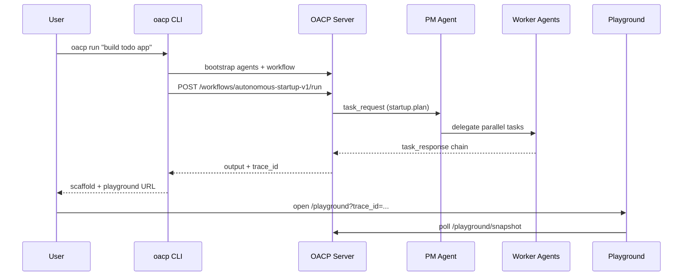

# What is OACP?

**OACP (Open Agent Collaboration Protocol)** is a multi-agent **task execution and collaboration layer**. It gives autonomous agents a common way to discover each other, exchange structured tasks, delegate work, and coordinate — with a **live visual playground** so you can see collaboration happen, not just read logs.

## One-liner

> A multi-agent task-execution system you can watch working live.

## The problem

Building one capable agent is increasingly easy. Getting **several agents to reliably work together** is not. Teams today wire ad-hoc HTTP calls, custom JSON payloads, and invisible message passing with no shared identity, capability model, or delivery guarantees.

OACP standardizes the boring-but-critical infrastructure:

| Concern        | OACP approach                                                                 |
| -------------- | ----------------------------------------------------------------------------- |
| Message format | JSON Schema `task_request`, `task_response`, `delegation`, `capability_query` |
| Identity       | Every agent declares `id`, capabilities, and public key                       |
| Routing        | Capability-based auto-routing with registry lookup                            |
| Reliability    | Retries, timeouts, alternate-agent failover                                   |
| Coordination   | DAG workflows, subtask plans, delegation graphs                               |
| Observability  | Structured logs, trace timelines, playground UI                               |

## Architecture at a glance


<details>
<summary>Text diagram</summary>

```text
┌──────────────────────────────────────────────────────────────┐
│              Applications — CLI · Playground · Examples       │
└───────────────────────────────┬──────────────────────────────┘
                                │
┌───────────────────────────────▼──────────────────────────────┐
│                    @oacp/sdk — Agent · AgentClient              │
└───────────────────────────────┬──────────────────────────────┘
                                │
┌───────────────────────────────▼──────────────────────────────┐
│   @oacp/core — validation · bus · runtime · workflow · memory │
└───────────────────────────────┬──────────────────────────────┘
                                │ validates
┌───────────────────────────────▼──────────────────────────────┐
│              specs/ — JSON Schema (source of truth)           │
└──────────────────────────────────────────────────────────────┘

        Network layer (optional):
┌──────────────────────────────────────────────────────────────┐
│   @oacp/server — HTTP API · registry · workflow runner         │
└──────────────────────────────────────────────────────────────┘
```

</details>

See [Architecture](/architecture) for package boundaries and module map.

## How a workflow runs



## Positioning

| Say this                                         | Don't say this                       |
| ------------------------------------------------ | ------------------------------------ |
| Multi-agent task execution & collaboration layer | Universal AI coordination standard   |
| Interoperates with MCP / A2A where possible      | Replacement for every agent protocol |

The agent-protocol space includes MCP (Anthropic), A2A (Google), and others. OACP's edge is **developer experience plus live visualization** — especially the [playground](/playground).

## What ships today (v0.1 alpha)

- **Protocol core** — schemas, validation, in-process message bus, agent runtime
- **Networking** — reference HTTP server, remote SDK, capability registry and routing
- **Collaboration** — memory store, delegation graphs, DAG workflow engine, failure recovery
- **Adoption** — playground UI, Autonomous Startup Team demo, `oacp` CLI, example gallery

Status: **early alpha**. APIs and schemas may change until `v1.0`. See the [README roadmap](https://github.com/naaa-G/OACP#-roadmap).

## Next steps

- [Quick start](/quick-start) — runnable in under 5 minutes
- [Development guide](/development) — monorepo setup and CI
- [Example gallery](/examples-gallery) — coding, research, and bug-finder swarms
- [CLI](/cli) — terminal workflows and trace inspection
