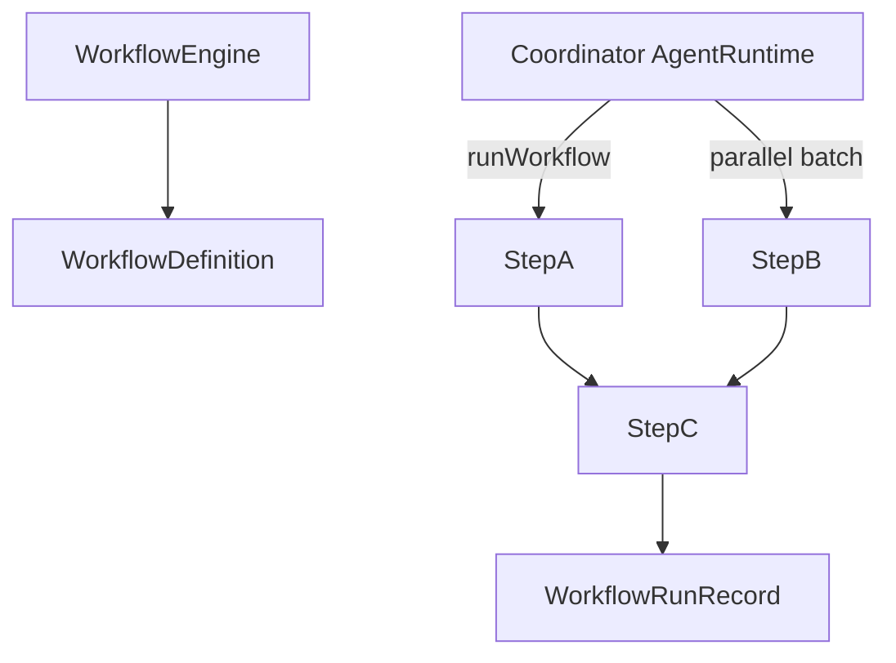

# DAG workflow engine (Day 18)

Day 18 adds a **formal DAG workflow engine** for coordinator-driven execution. Register workflow definitions, run them from a coordinator `AgentRuntime`, and query persisted run records.

This complements:

- [Subtask decomposition](./subtask-decomposition.md) (Day 17) — in-agent planning via `decomposeAndExecute`
- [Multi-agent pipeline](./multi-agent-pipeline.md) (Day 13) — sequential `runPipeline`
- [Delegation graph](./delegation-graph.md) (Day 16) — parent/child tracking per step

## Concepts

| Term                   | Meaning                                                               |
| ---------------------- | --------------------------------------------------------------------- |
| **WorkflowDefinition** | Registered DAG with stable `id`, steps, and optional `reduceOutput`   |
| **WorkflowEngine**     | Registers definitions, runs workflows, stores run history             |
| **WorkflowRunRecord**  | Status (`pending` → `running` → `completed` / `failed`), trace, steps |
| **Batch**              | Topological level — steps in a batch may run in parallel              |



## Register a workflow

```typescript
import { WorkflowEngine, type WorkflowDefinition } from '@oacp/core';

const engine = new WorkflowEngine();

const definition: WorkflowDefinition = {
  id: 'document-dag',
  name: 'Document Processing',
  version: '1.0',
  steps: [
    { id: 'tokenize', capability: 'text.tokenize', input: { text: 'hello world' } },
    {
      id: 'summarize',
      capability: 'text.summarize',
      dependsOn: ['tokenize'],
      mapInput: (ctx) => ({
        text: (ctx.getStepResult('tokenize')?.output?.tokens ?? []).join(' '),
      }),
    },
  ],
  reduceOutput: (ctx) => ({
    summary: ctx.getStepResult('summarize')?.output?.summary,
  }),
};

engine.register(definition);
```

## Run from a coordinator

```typescript
import { createAgentRuntime, createMessageBus } from '@oacp/core';

const bus = createMessageBus();
const coordinator = createAgentRuntime({ identity: coordinatorIdentity, bus });
coordinator.start();

const result = await engine.run('document-dag', coordinator, { topic: 'Q4 report' });

if (result.ok) {
  console.log(result.runId, result.traceId, result.output);
}

const run = await engine.getRun(result.runId);
console.log(run?.status); // 'completed'
```

Use `runWorkflow()` directly when you do not need run persistence:

```typescript
import { runWorkflow } from '@oacp/core';

const result = await runWorkflow(coordinator, definition, { topic: 'Q4 report' });
```

## SDK + `Agent`

```typescript
import { Agent, LocalBus, WorkflowEngine } from '@oacp/sdk';

const coordinator = new Agent({ name: 'coordinator', capabilities: ['orchestrate.workflow'], bus });
await coordinator.start();

const result = await engine.run('document-dag', coordinator.agentRuntime, {});
```

## HTTP API (`@oacp/server`)

| Endpoint                          | Description                           |
| --------------------------------- | ------------------------------------- |
| `GET /workflows`                  | List registered definitions           |
| `POST /workflows`                 | Register a `WorkflowDefinition`       |
| `POST /workflows/:workflowId/run` | Run workflow (`{ "input": { ... } }`) |
| `GET /workflows/runs/:runId`      | Query run status and results          |

Start the server with dev workflows preloaded, then run a workflow.

```powershell
# Terminal 1 — enable demo workers + workflow definitions
$env:OACP_DEV_WORKFLOWS = "1"
pnpm --filter @oacp/server start
```

```powershell
# Terminal 2 — run echo-workflow
Invoke-RestMethod -Method POST `
  -Uri "http://localhost:3847/workflows/echo-workflow/run" `
  -ContentType "application/json" `
  -Body '{"input":{}}'

# Or run the full document DAG
Invoke-RestMethod -Method POST `
  -Uri "http://localhost:3847/workflows/document-dag/run" `
  -ContentType "application/json" `
  -Body '{"input":{}}'
```

Without `OACP_DEV_WORKFLOWS=1`, the server starts with an **empty** workflow registry — you must register workers (`POST /agents` + in-process handlers) and definitions (`POST /workflows`) yourself. The in-process example (`start:workflow-engine`) uses its own bus and does not talk to the HTTP server.

**bash / Git Bash / WSL**

```bash
curl -X POST http://localhost:3847/workflows/echo-workflow/run \
  -H "Content-Type: application/json" \
  -d '{"input":{}}'
```

**PowerShell** — use `curl.exe` (real curl) or `Invoke-RestMethod`:

```powershell
# Option A: real curl (note .exe — avoids PowerShell alias)
curl.exe -X POST http://localhost:3847/workflows/echo-workflow/run `
  -H "Content-Type: application/json" `
  -d "{\"input\":{}}"

# Option B: native PowerShell
Invoke-RestMethod -Method POST `
  -Uri "http://localhost:3847/workflows/echo-workflow/run" `
  -ContentType "application/json" `
  -Body '{"input":{}}'
```

`echo-workflow` must be registered via `POST /workflows` before you can run it — or set `OACP_DEV_WORKFLOWS=1` when starting the server to preload `echo-workflow` and `document-dag` with workers.

## Shared DAG executor

Both Day 17 (`executeSubtaskPlan` via `sendSubTask`) and Day 18 (`runWorkflow` via `sendTask`) use `executeDagPlan` internally:

- Validates acyclic `dependsOn` graph
- Runs topological batches (parallel within batch)
- Links steps in the [delegation graph](./delegation-graph.md) via `requestMessageId`

## Error codes

| Code                     | When                      |
| ------------------------ | ------------------------- |
| `WORKFLOW_NOT_FOUND`     | Unknown workflow id       |
| `WORKFLOW_RUN_NOT_FOUND` | Unknown run id (HTTP 404) |
| `WORKFLOW_PLAN_INVALID`  | Invalid definition        |
| `WORKFLOW_PLAN_CYCLE`    | Circular dependencies     |
| `WORKFLOW_STEP_FAILED`   | Downstream task failed    |

## Comparison

| API                   | Who runs steps                  | Persistence     | Typical use                |
| --------------------- | ------------------------------- | --------------- | -------------------------- |
| `runPipeline`         | Coordinator                     | Trace only      | Fixed sequential ETL       |
| `decomposeAndExecute` | Orchestrator agent (in handler) | Optional memory | Dynamic agent plans        |
| `WorkflowEngine.run`  | Coordinator runtime             | Run records     | Registered enterprise DAGs |

## Runnable examples

```bash
pnpm --filter oacp-examples start:workflow        # Day 17 in-agent decomposition
pnpm --filter oacp-examples start:workflow-engine # Day 18 registered DAG engine
```

## Related

- [Failure recovery](./failure-recovery.md) (Day 19)
- [Subtask decomposition](./subtask-decomposition.md)
- [Agent runtime](./agent-runtime.md)
- [HTTP server](./http-server.md)
